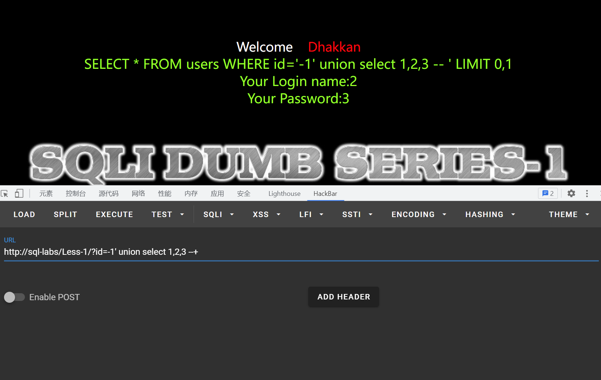

## 知识点：
单引号sql注入 联合注入

## 思路：

先试试整型注入，发现没用 		

向后面加入单引号，发现可以单引号注入 	

		后面加上 --+ 将后面的limit注释掉 	

使用order by 确定列的数量，发现为3			

使用联合注入，查看回显的列，发现为2，3列	 之后先用database(),user()查看数据库名和用户名	 再查看数据库中的表	 再看看users表中列	 查询users表中id，name，password的数据
