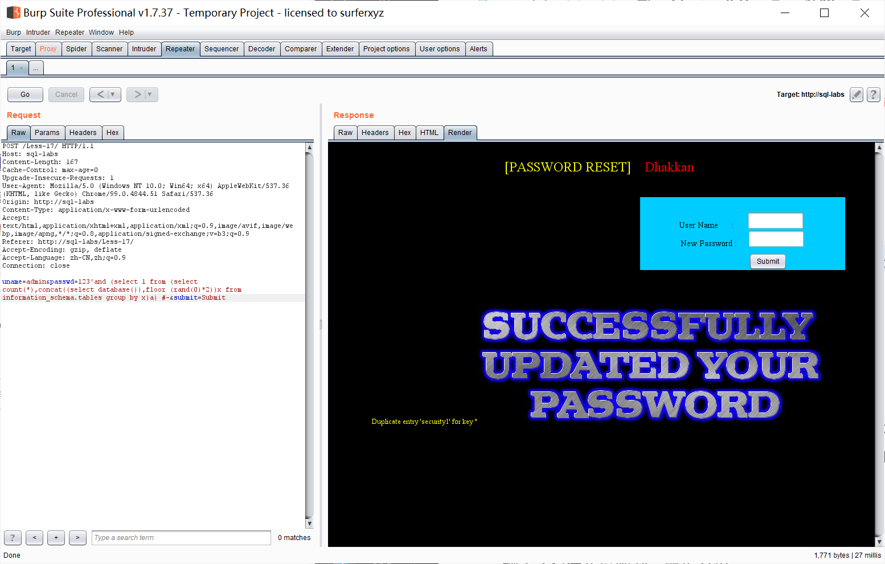

# 知识点：
过滤函数：
```php
function check_input($value)
	{
	if(!empty($value))
		{
		// truncation (see comments)
		$value = substr($value,0,15);
		}

		// Stripslashes if magic quotes enabled
		if (get_magic_quotes_gpc()) //检测是否开启magic_quotes_apc
			{
			$value = stripslashes($value);//若开启则删除反斜杠
			}

		// Quote if not a number
		if (!ctype_digit($value))//判断是否为数值
			{
			$value = "'" . mysql_real_escape_string($value) . "'";//若不是则对其进行过滤
			}//mysql_real_escape_string()转义 SQL 语句中使用的字符串中的特殊字符
		
	else
		{
		$value = intval($value);//intval()整型准换
		}
	return $value;
	}
```
# 思路：

