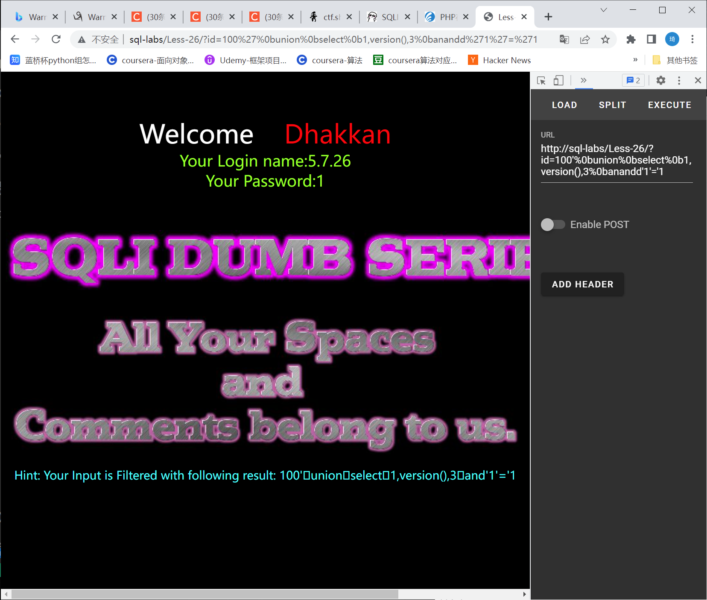

# 知识点：
or and 过滤 / * 过滤 -- 过滤 #过滤 空格 过滤 / 过滤
# 思路：
过滤了 or 和 and 可以采用 双写或者 && || 绕过 或者 anandd oorr 过滤注释 可以使用闭合绕过 ' payload and '1'=' 过滤了空格 可以使用如下的符号来替代:

| 符号 | 说明 |
| --- | --- |
| %09 | TAB 键(水平) |
| %0a | 新建一行 |
| %0c | 新的一页 |
| %0d | return 功能 |
| %0b | TAB 键(垂直) |
| %a0 | 空格 |

例子： 
