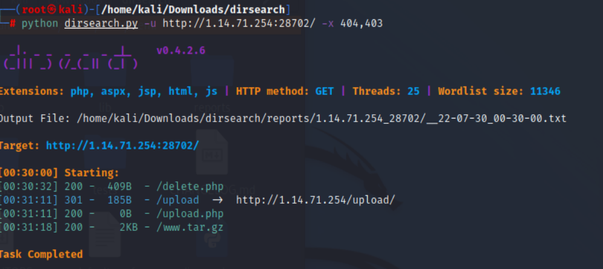
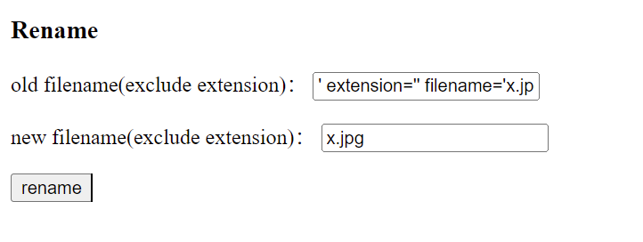

# 知识点
### 代码审计
### 二次注入
### 文件上传getshell
# 思路
看到题目能够上传文件，想到肯定需要通过上传文件来getshell<br />做题第一步先扫目录<br />用dirsearch扫描目录，扫出源码备份压缩包<br /><br />下载解压到本地，进行代码审计<br />upload.php对文件的后缀进行了白名单限制，导致我们无法上传.php文件，我们需要想办法修改文件后缀，我们考虑通过sql注入来修改文件后缀名
```php
		// 文件名白名单
		if (!in_array($path_parts["extension"], array("gif", "jpg", "png", "zip", "txt"))) {
			exit("error extension");
		}
```
首先查看common.inc.php发现对全局变量都进行了转义，导致直接的注入基本失效，转而考虑二次注入
```php
foreach (array($_GET, $_POST, $_COOKIE) as $global_var) {
  foreach ($global_var as $key => $value) {
    is_string($value) && $req[$key] = addslashes($value);
  }
}
```
要二次注入，一般就是查找进行修改功能的地方，所以我们把目标锁定再rename.php<br />通过代码审计我们能发现，rename.php会从数据库中拿出filename字段数据进行使用，并且没有进行处理，所以我们可以再此进行二次注入
```php
$re = $db->query("update `file` set `filename`='{$req['newname']}', `oldname`='{$result['filename']}' where `fid`={$result['fid']}");

$oldname = UPLOAD_DIR . $result["filename"] . $result["extension"];
$newname = UPLOAD_DIR . $req["newname"] . $result["extension"];
```
但我们会发现修改的extension是一样的，我们可以让extension变为空，这样就不会受到extension的影响了。<br />通过文件名构造sql注入语句',extension='',filename='x.jpg.jpg<br />将文件进行上传<br />通过rename模块将extension设置为空，并且将filename设置为x.jpg<br /><br />我们再上传x.jpg,这是我们真正的木马文件<br />将x.jpg更名为x.php<br />从而getshell
