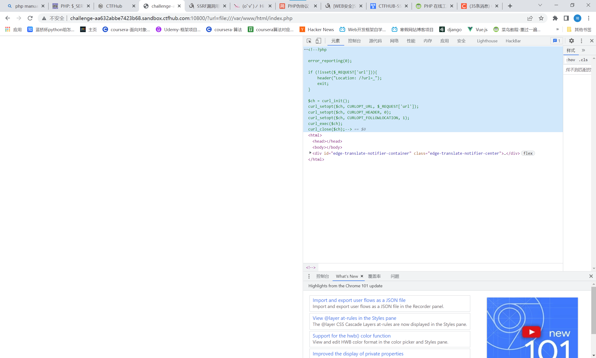
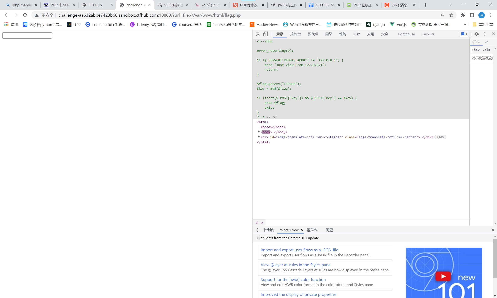
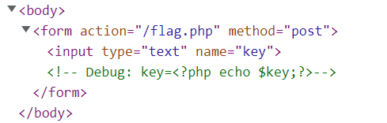
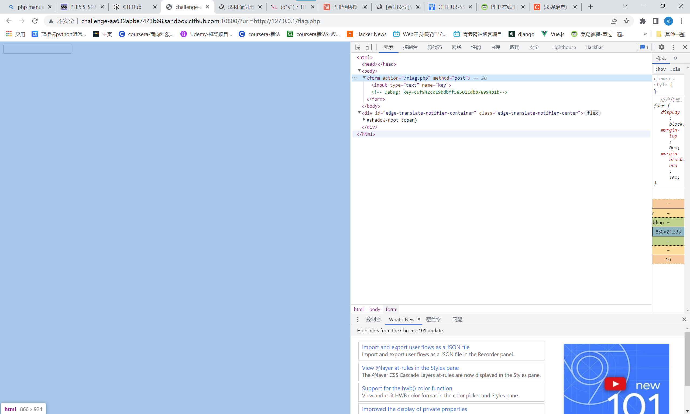
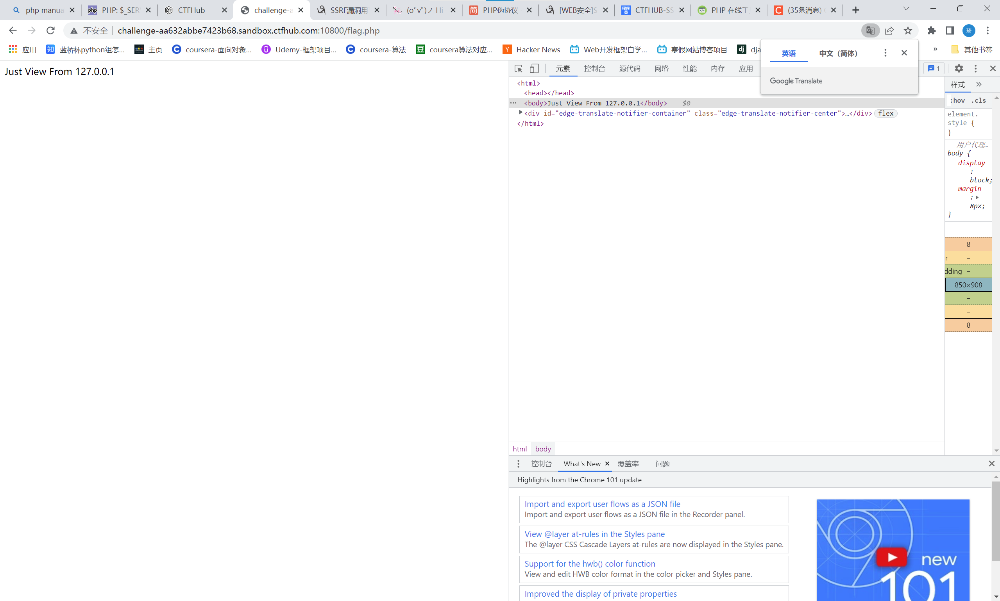
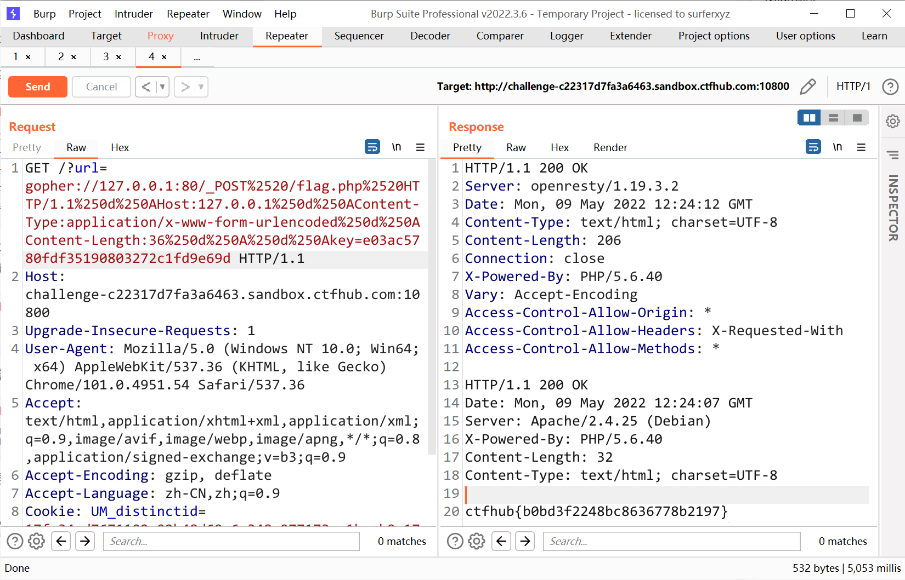

# 知识点
file:// 读文件<br />gopher:// POST请求

# 思路
先用file://读取index.php 发现使用了curl<br /><br />再读取flag.php 发现要post key值与$key相等<br /><br />下方注释有<?php echo $key ?><br /><br />用http://访问执行，查看到$key<br /><br />尝试上传，发现必须要ip为127.0.0.1，且无法伪造<br /><br />尝试再首页使用gopher POST传递key值

因为get传参会进行因此url解码，curl也会进行一次url解码所以要对POST请求进行二次url编码

在转换为URL编码时候有这么几个坑<br />1、问号（？）需要转码为URL编码，也就是%3f<br />2、回车换行要变为%0d%0a,但如果直接用工具转，可能只会有%0a<br />3、在HTTP包的最后要加%0d%0a，代表消息结束（具体可研究HTTP包结束

payload
```
?url=gopher://127.0.0.1:80/_POST%2520/flag.php%2520HTTP/1.1%250d%250AHost:127.0.0.1%250d%250AContent-Type:application/x-www-form-urlencoded%250d%250AContent-Length:36%250d%250A%250d%250Akey=e03ac5780fdf35190803272c1fd9e69d
```

