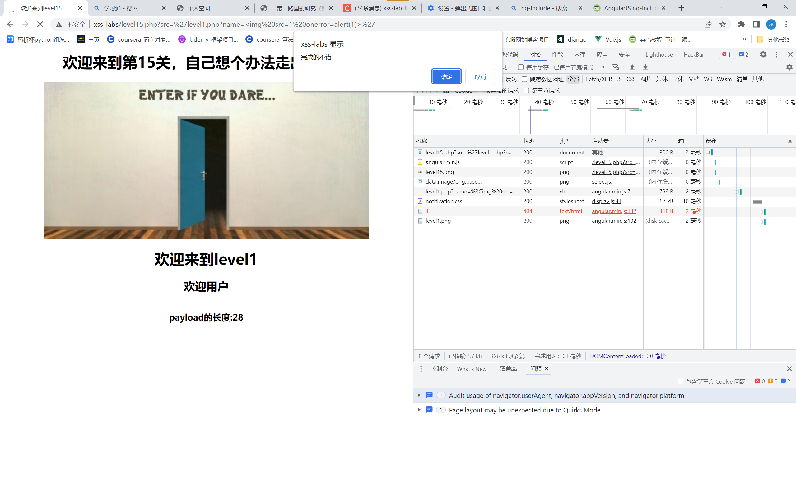

# 知识点：
angular.js  ng-include xss注入<br />1、ng-include 指令用于包含外部的 HTML文件。
<br />2、包含的内容将作为指定元素的子节点。
<br />3、ng-include 属性的值可以是一个表达式，返回一个文件名。
<br />4、默认情况下，包含的文件需要包含在同一个域名下。
<br />特别值得注意的几点如下：
<br />1.ng-include,如果单纯指定地址，必须要加引号
<br />2.ng-include,加载外部html，script标签中的内容不执行
<br />3.ng-include,加载外部html中含有style标签样式可以识别

# 思路：
payload

```
?src='level1.php?name='
```

