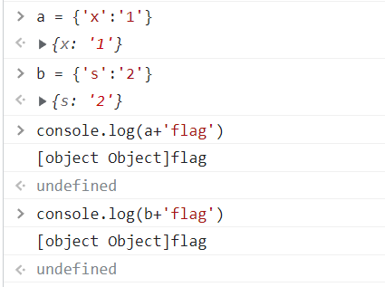
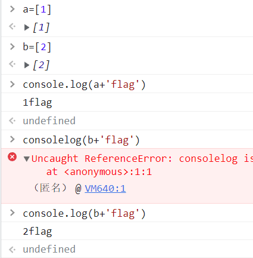
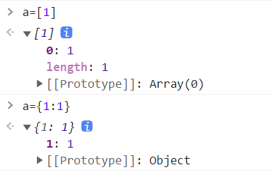

# 知识点
使用对象来绕过md5<br />[JavaScript中{},[]中括号,大括号的含义和使用_Thinkingcao的博客-CSDN博客](https://blog.csdn.net/thinkingcao/article/details/65632675)
# 思路
```php
?a[x]=1&b[s]=2
```

这样传参相当于传递了a和b两个对象<br /><br />但想如下这样是不行的
```php
?a[0]=1&b[0]=2
```
因为这样相当于传递的是数组对象<br />相当于这样

<br />可以看看这两种创建方法的差别<br />
