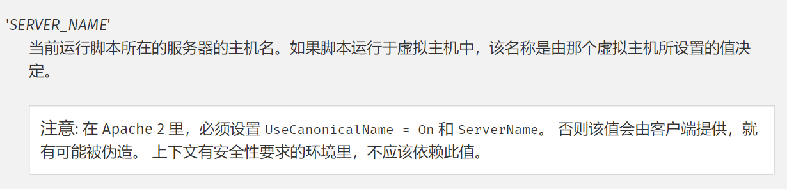
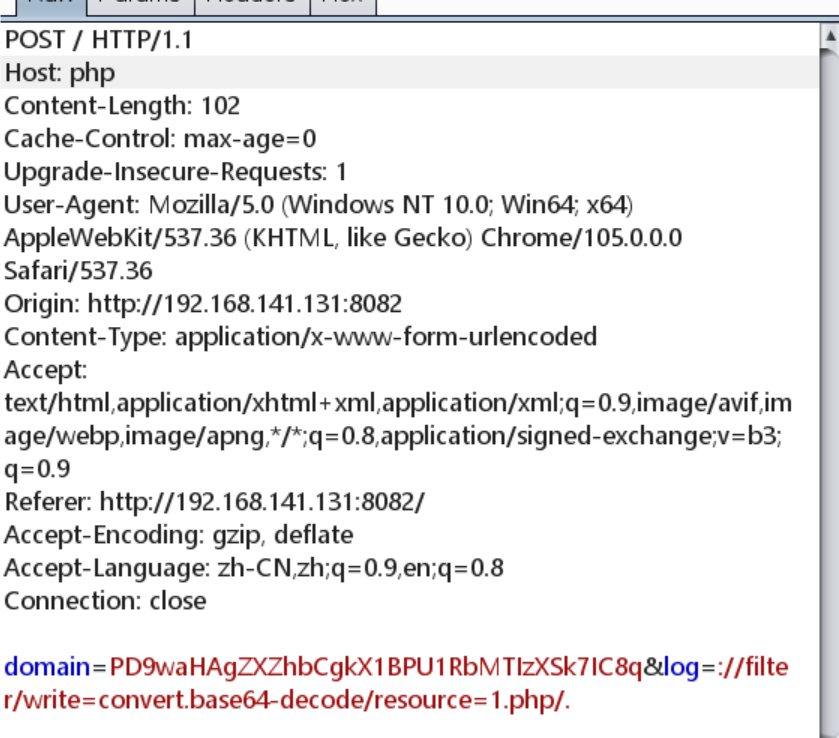

## $_SERVER['PHP_SELF']
### 任意控制$_SERVER['PHP_SELF']的值
[PHP 使用 $_SERVER[‘PHP_SELF’] 获取当前页面地址及其安全性问题_PHP基础教程 - 我爱开发网](http://www.5idev.com/p-php_server_php_self.shtml) [PHP 使用 $_SERVER['PHP_SELF'] 获取当前页面地址及其安全性问题_PHP基础教程 - 我爱开发网.pdf](https://www.yuque.com/attachments/yuque/0/2023/pdf/25358086/1689262305118-e313db35-9432-414c-a0c0-1a499a701398.pdf)
## $_SERVER['SERVER_NAME'] 
### 任意控制$_SERVER['SERVER_NAME']的值
 查看文档我们可以发现，在Apache2下如果我们配置不当，会让客户端任意控制$_SERVER['SERVER_NAME']的值，该值通过Http报文头host来进行修改 
## $_SERVER['QUERY_STRING']
### URL编码绕过
`$_SERVER['QUERY_STRING']`不会进行urldecode，`$_GET`会，用URL编码绕过
