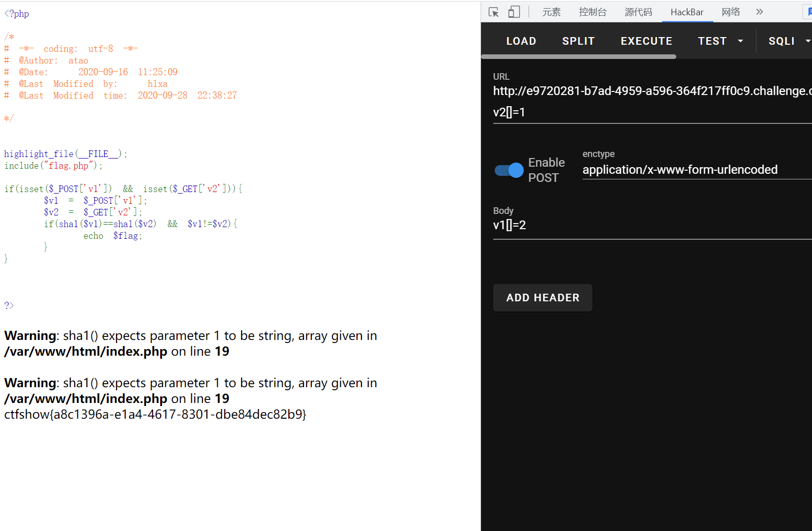

# 知识点
# 思路
```php
<?php

highlight_file(__FILE__);
include("flag.php");

if(isset($_POST['v1']) && isset($_GET['v2'])){
    $v1 = $_POST['v1'];
    $v2 = $_GET['v2'];
    if(sha1($v1)==sha1($v2) && $v1!=$v2){
        echo $flag;
    }
}


?>
```

与web104相同


