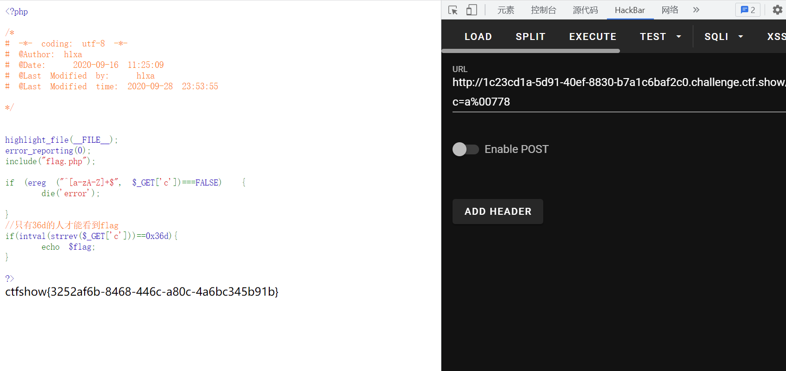

# 知识点
### ereg函数的截断漏洞
ereg()函数用指定的模式搜索一个字符串中指定的字符串,如果匹配成功返回true,否则,则返回false。搜索字 母的字符是大小写敏感的。 ereg函数存在NULL截断漏洞，导致了正则过滤被绕过,所以可以使用%00截断正则匹配<br />[https://blog.csdn.net/qq_25987491/article/details/79952393](https://blog.csdn.net/qq_25987491/article/details/79952393)
### strrev
反转字符串
# 思路

```php
<?php

highlight_file(__FILE__);
error_reporting(0);
include("flag.php");

if (ereg ("^[a-zA-Z]+$", $_GET['c'])===FALSE)  {
    die('error');

}
//只有36d的人才能看到flag
if(intval(strrev($_GET['c']))==0x36d){
    echo $flag;
}

?>
```
```php
?c=a%00778
```

