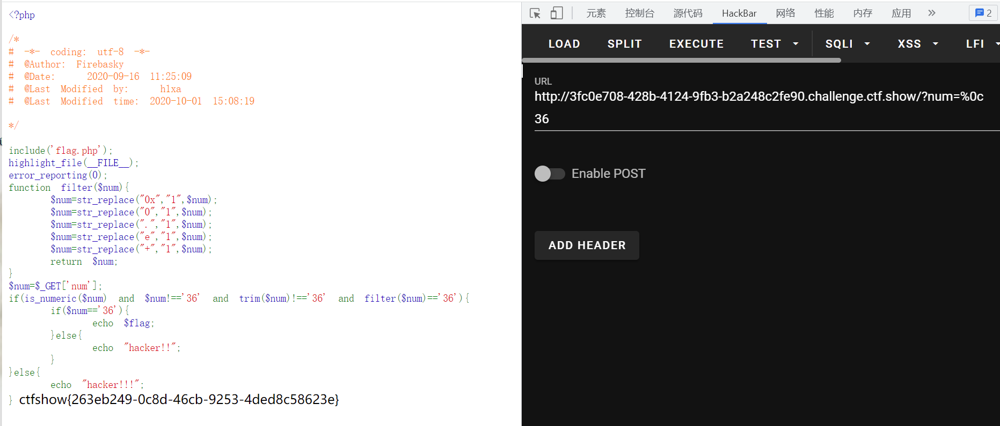

# 知识点
### trim
[https://www.php.net/manual/zh/function.trim.php](https://www.php.net/manual/zh/function.trim.php)
### str_replace
[https://www.php.net/manual/zh/function.str-replace.php](https://www.php.net/manual/zh/function.str-replace.php)
# 思路
```php
<?php

include('flag.php');
highlight_file(__FILE__);
error_reporting(0);
function filter($num){
    $num=str_replace("0x","1",$num);
    $num=str_replace("0","1",$num);
    $num=str_replace(".","1",$num);
    $num=str_replace("e","1",$num);
    $num=str_replace("+","1",$num);
    return $num;
}
$num=$_GET['num'];
if(is_numeric($num) and $num!=='36' and trim($num)!=='36' and filter($num)=='36'){
    if($num=='36'){
        echo $flag;
    }else{
        echo "hacker!!";
    }
}else{
    echo "hacker!!!";
}
```
查看文档能发现trim不会将%0c换页符清除，所以payload为
```php
?num=%0c36
```

