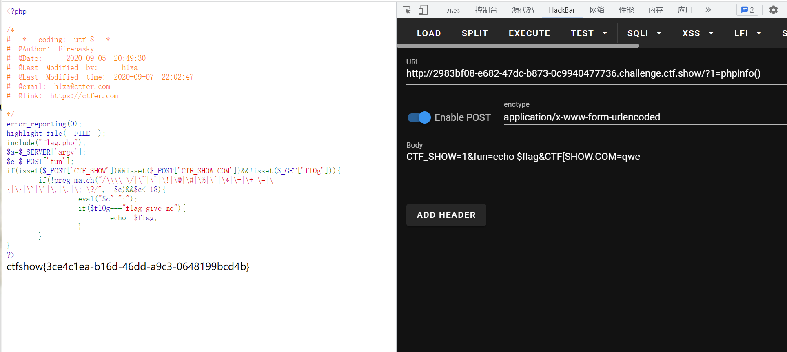

# 知识点
### php参数非法字符的过滤
在php中变量名只有数字字母下划线，被get或者post传入的变量名，如果含有空格、.、[则会被转化为_，所以按理来说我们构造不出CTF_SHOW.COM这个变量(因为含有.)，但php中有个特性就是如果传入[，它被转化为_之后，后面的字符就会被保留下来不会被替换
### implode
可以将一维数组转换为字符串<br />[https://www.php.net/manual/zh/function.implode.php](https://www.php.net/manual/zh/function.implode.php)
# 思路
```php
方法一 CTF_SHOW=1&CTF[SHOW.COM=qwe&fun=echo $flag
方法二 CTF_SHOW=1&CTF[SHOW.COM=qwe&fun=echo implode(get_defined_vars())
```

