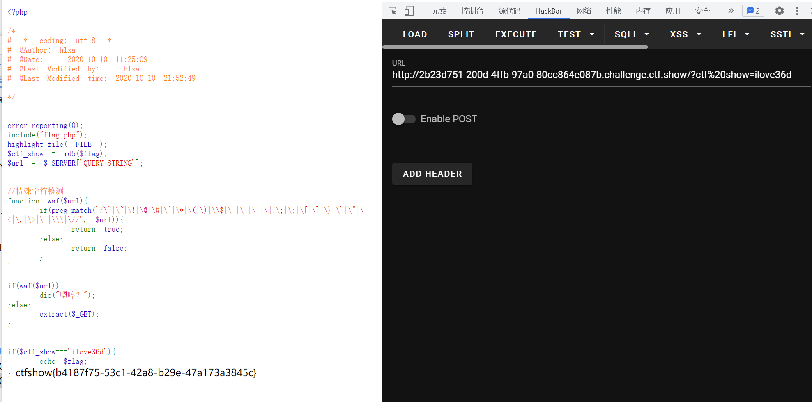

# 知识点
还是利用了php对GET、POST以及COOKIES的变量解析的体系绕过了特殊字符的过滤
### **利用PHP的字符串解析特性Bypass**
[https://www.freebuf.com/articles/web/213359.html](https://www.freebuf.com/articles/web/213359.html)
### 相关php内核分析（现在还看不懂QAQ）
[https://y4tacker.blog.csdn.net/article/details/120502141](https://y4tacker.blog.csdn.net/article/details/120502141)
# 思路
```php
<?php

/*
# -*- coding: utf-8 -*-
# @Author: h1xa
# @Date:   2020-10-10 11:25:09
# @Last Modified by:   h1xa
# @Last Modified time: 2020-10-10 21:52:49

*/


error_reporting(0);
include("flag.php");
highlight_file(__FILE__);
$ctf_show = md5($flag);
$url = $_SERVER['QUERY_STRING'];


//特殊字符检测
function waf($url){
    if(preg_match('/\`|\~|\!|\@|\#|\^|\*|\(|\)|\\$|\_|\-|\+|\{|\;|\:|\[|\]|\}|\'|\"|\<|\,|\>|\.|\\\|\//', $url)){
        return true;
    }else{
        return false;
    }
}

if(waf($url)){
    die("嗯哼？");
}else{
    extract($_GET);
}


if($ctf_show==='ilove36d'){
    echo $flag;
}
```
```php
?ctf%20show=ilove36d
```

