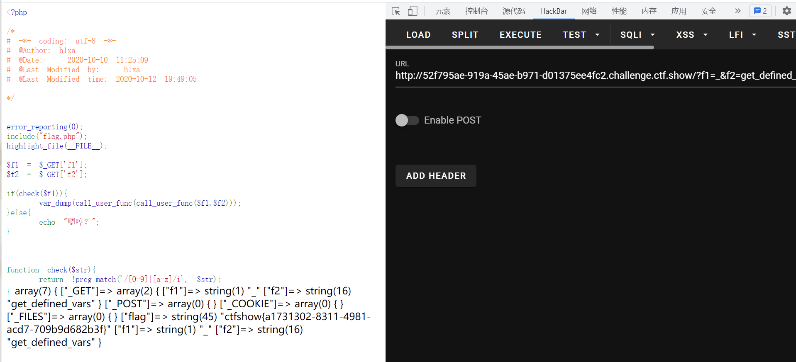

# 知识点
### gettext
[https://www.php.net/manual/zh/book.gettext.php](https://www.php.net/manual/zh/book.gettext.php)
```php
<?php
echo gettext("dotastnb");
//输出结果：dotastnb

echo _("ctfshownb");
//输出结果：ctfshownb
```
# 思路
```php
?f1=_&f2=get_defined_vars

```

