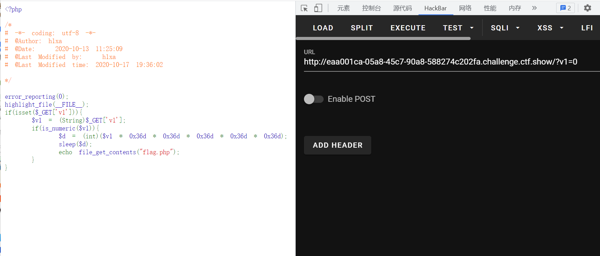

# 知识点

# 思路
```python
<?php

error_reporting(0);
highlight_file(__FILE__);
if(isset($_GET['v1'])){
    $v1 = (String)$_GET['v1'];
    if(is_numeric($v1)){
        $d = (int)($v1 * 0x36d * 0x36d * 0x36d * 0x36d * 0x36d);
        sleep($d);
        echo file_get_contents("flag.php");
    }
}

```
```python
?v1=0
把秒数变为0便可
```

